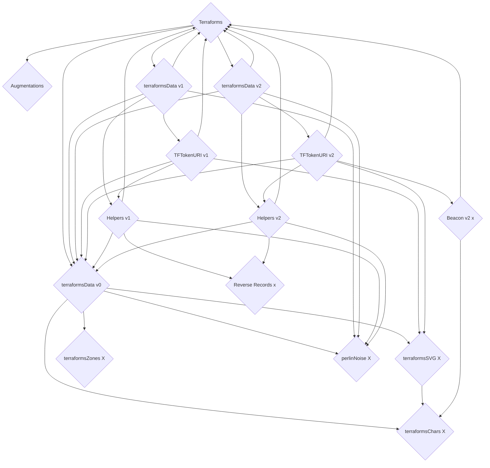
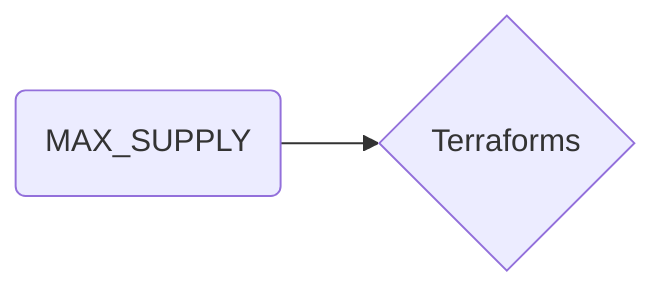

[0x4E1f41613c9084FdB9E34E11fAE9412427480e56](https://etherscan.io/token/0x4E1f41613c9084FdB9E34E11fAE9412427480e56#code)
<style>
ul#menu li {
  display:inline;
  margin-right: 5px;
  
}
ul#menu {
  padding-left: 0 !important;
}
</style>

:::
<ul id="menu">
  <li><a href="https://remix.ethereum.org/#address=0x4e1f41613c9084fdb9e34e11fae9412427480e56&lang=en&optimize=false&runs=200&evmVersion=null&version=soljson-v0.8.22+commit.4fc1097e.js"></a></li>
    <li><a href="https://vscode.blockscan.com/ethereum/0x4E1f41613c9084FdB9E34E11fAE9412427480e56"></a></li>
</ul> 
:::



+++ Read
==- MAX_SUPPLY (uint256)

==- OWNER_ALLOTMENT (uint256)
==- PRICE (uint256)
==- REVEAL_TIMESTAMP (uint256)
==- SUPPLY (uint256)
==- TOKEN_SCALE (int256)
==- balanceOf (uint256)
==- dreamers (uint256)
==- earlyMintActive (bool)
==- getApproved (address)
==- isApprovedForAll (bool)
==- mintingPaused (bool)
==- name (string)
==- owner (address)
==- ownerOf (address)
==- seed (uint256)
==- structureData (uint256)
==- supportsInterface (bool)
==- symbol (string)
==- terraformsAugmentationAddress (address)
==- tokenByIndex (uint256)
==- tokenCharacters string[32][32]
==- tokenCounter (uint256)
==- tokenHTML (string)
==- tokenHeightmapIndicies (uint256[32][32])
==- tokenOfOwnerByIndex (uint256)
==- tokenSVG (string)
==- tokenSupplementalData (tuple)
==- tokenTerrainValues (int256[32][32])
==- tokenToAuthorizedDreamer (address)
==- tokenToCanvasData
==- tokenToDreamBlock
==- tokenToDreamer
==- tokenToPlacement
==- tokenToStatus
==- tokenURI
==- tokenURIAddresses
==- totalSupply
===
+++ Write
==- addTokenURIAddress
==- approve							
==- authorizeDreamer
==- commitDreamToCanvas
==- earlyMint
==- enterDream
==- mint
==- ownerClaim
==- redeemMintpass
==- renounceOwnership
==- safeTransferFrom
==- safeTransferFrom
==- setApprovalForAll
==- setMintpassHolders
==- setSeed
==- setTokenURIAddress
==- toggleEarly
==- togglePayse
==- transferFrom
==- transferOwnership
==- withrdraw
===
+++ Code
```js
// File 1 of 18 : Ownable.sol
// SPDX-License-Identifier: MIT
// OpenZeppelin Contracts v4.4.0 (access/Ownable.sol)

pragma solidity ^0.8.0;

import "../utils/Context.sol";

/**
 * @dev Contract module which provides a basic access control mechanism, where
 * there is an account (an owner) that can be granted exclusive access to
 * specific functions.
 *
 * By default, the owner account will be the one that deploys the contract. This
 * can later be changed with {transferOwnership}.
 *
 * This module is used through inheritance. It will make available the modifier
 * `onlyOwner`, which can be applied to your functions to restrict their use to
 * the owner.
 */
abstract contract Ownable is Context {
    address private _owner;

    event OwnershipTransferred(address indexed previousOwner, address indexed newOwner);

    /**
     * @dev Initializes the contract setting the deployer as the initial owner.
     */
    constructor() {
        _transferOwnership(_msgSender());
    }

    /**
     * @dev Returns the address of the current owner.
     */
    function owner() public view virtual returns (address) {
        return _owner;
    }

    /**
     * @dev Throws if called by any account other than the owner.
     */
    modifier onlyOwner() {
        require(owner() == _msgSender(), "Ownable: caller is not the owner");
        _;
    }

    /**
     * @dev Leaves the contract without owner. It will not be possible to call
     * `onlyOwner` functions anymore. Can only be called by the current owner.
     *
     * NOTE: Renouncing ownership will leave the contract without an owner,
     * thereby removing any functionality that is only available to the owner.
     */
    function renounceOwnership() public virtual onlyOwner {
        _transferOwnership(address(0));
    }

    /**
     * @dev Transfers ownership of the contract to a new account (`newOwner`).
     * Can only be called by the current owner.
     */
    function transferOwnership(address newOwner) public virtual onlyOwner {
        require(newOwner != address(0), "Ownable: new owner is the zero address");
        _transferOwnership(newOwner);
    }

    /**
     * @dev Transfers ownership of the contract to a new account (`newOwner`).
     * Internal function without access restriction.
     */
    function _transferOwnership(address newOwner) internal virtual {
        address oldOwner = _owner;
        _owner = newOwner;
        emit OwnershipTransferred(oldOwner, newOwner);
    }
}
********************
```
+++
