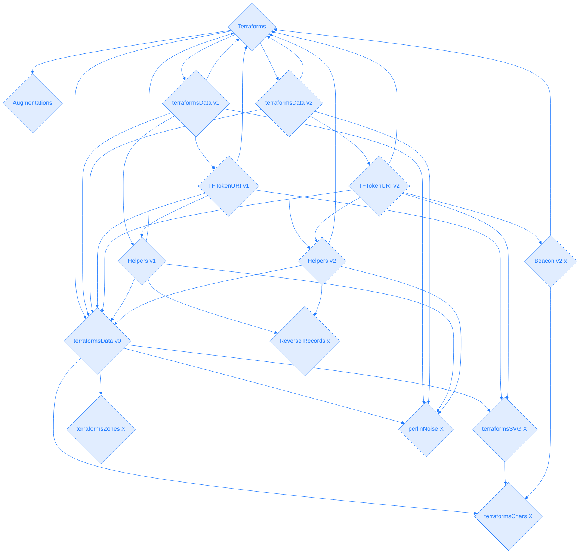

<style>
ul#menu li {
  display:inline;
  margin-right: 5px;
  
}
ul#menu {
  padding-left: 0 !important;
}

.py-4 {
  background: none !important;
}
#terraforms h1 {
 margin-bottom: 0 !important;
}
#address p {
 margin-bottom: 0 !important;
}
</style>

:::
<div id='address'><a href="https://etherscan.io/token/0x4E1f41613c9084FdB9E34E11fAE9412427480e56#code">0x4E1f41613c9084FdB9E34E11fAE9412427480e56</a></div>
<ul id="menu">
  <li><a href="https://remix.ethereum.org/#address=0x4e1f41613c9084fdb9e34e11fae9412427480e56&lang=en&optimize=false&runs=200&evmVersion=null&version=soljson-v0.8.22+commit.4fc1097e.js"></a></li>
    <li><a href="https://vscode.blockscan.com/ethereum/0x4E1f41613c9084FdB9E34E11fAE9412427480e56"></a></li>
</ul> 
:::



+++ Read
==- MAX_SUPPLY (uint256)
==- OWNER_ALLOTMENT (uint256)
==- PRICE (uint256)
==- REVEAL_TIMESTAMP (uint256)
==- SUPPLY (uint256)
==- TOKEN_SCALE (int256)
==- balanceOf (uint256)
==- dreamers (uint256)
==- earlyMintActive (bool)
==- getApproved (address)
==- isApprovedForAll (bool)
==- mintingPaused (bool)
==- name (string)
==- owner (address)
==- ownerOf (address)
==- seed (uint256)
==- structureData (uint256)
==- supportsInterface (bool)
==- symbol (string)
==- terraformsAugmentationAddress (address)
==- tokenByIndex (uint256)
==- tokenCharacters string[32][32]
==- tokenCounter (uint256)
==- tokenHTML (string)
==- tokenHeightmapIndicies (uint256[32][32])
==- tokenOfOwnerByIndex (uint256)
==- tokenSVG (string)
==- tokenSupplementalData (tuple)
==- tokenTerrainValues (int256[32][32])
==- tokenToAuthorizedDreamer (address)
==- tokenToCanvasData
==- tokenToDreamBlock
==- tokenToDreamer
==- tokenToPlacement
==- tokenToStatus
==- tokenURI
==- tokenURIAddresses
==- totalSupply
===
+++ Write
==- addTokenURIAddress
==- approve							
==- authorizeDreamer
==- commitDreamToCanvas
==- earlyMint
==- enterDream
==- mint
==- ownerClaim
==- redeemMintpass
==- renounceOwnership
==- safeTransferFrom
==- safeTransferFrom
==- setApprovalForAll
==- setMintpassHolders
==- setSeed
==- setTokenURIAddress
==- toggleEarly
==- togglePayse
==- transferFrom
==- transferOwnership
==- withrdraw
===
+++ Code
=== File 1 of 18 : Ownable.sol
```js
// SPDX-License-Identifier: MIT
// OpenZeppelin Contracts v4.4.0 (access/Ownable.sol)

pragma solidity ^0.8.0;

import "../utils/Context.sol";

/**
 * @dev Contract module which provides a basic access control mechanism, where
 * there is an account (an owner) that can be granted exclusive access to
 * specific functions.
 *
 * By default, the owner account will be the one that deploys the contract. This
 * can later be changed with {transferOwnership}.
 *
 * This module is used through inheritance. It will make available the modifier
 * `onlyOwner`, which can be applied to your functions to restrict their use to
 * the owner.
 */
abstract contract Ownable is Context {
    address private _owner;

    event OwnershipTransferred(address indexed previousOwner, address indexed newOwner);

    /**
     * @dev Initializes the contract setting the deployer as the initial owner.
     */
    constructor() {
        _transferOwnership(_msgSender());
    }

    /**
     * @dev Returns the address of the current owner.
     */
    function owner() public view virtual returns (address) {
        return _owner;
    }

    /**
     * @dev Throws if called by any account other than the owner.
     */
    modifier onlyOwner() {
        require(owner() == _msgSender(), "Ownable: caller is not the owner");
        _;
    }

    /**
     * @dev Leaves the contract without owner. It will not be possible to call
     * `onlyOwner` functions anymore. Can only be called by the current owner.
     *
     * NOTE: Renouncing ownership will leave the contract without an owner,
     * thereby removing any functionality that is only available to the owner.
     */
    function renounceOwnership() public virtual onlyOwner {
        _transferOwnership(address(0));
    }

    /**
     * @dev Transfers ownership of the contract to a new account (`newOwner`).
     * Can only be called by the current owner.
     */
    function transferOwnership(address newOwner) public virtual onlyOwner {
        require(newOwner != address(0), "Ownable: new owner is the zero address");
        _transferOwnership(newOwner);
    }

    /**
     * @dev Transfers ownership of the contract to a new account (`newOwner`).
     * Internal function without access restriction.
     */
    function _transferOwnership(address newOwner) internal virtual {
        address oldOwner = _owner;
        _owner = newOwner;
        emit OwnershipTransferred(oldOwner, newOwner);
    }
}
```
=== File 2 of 18 : ReentrancyGuard.sol
```js
// SPDX-License-Identifier: MIT
// OpenZeppelin Contracts v4.4.0 (security/ReentrancyGuard.sol)

pragma solidity ^0.8.0;

/**
 * @dev Contract module that helps prevent reentrant calls to a function.
 *
 * Inheriting from `ReentrancyGuard` will make the {nonReentrant} modifier
 * available, which can be applied to functions to make sure there are no nested
 * (reentrant) calls to them.
 *
 * Note that because there is a single `nonReentrant` guard, functions marked as
 * `nonReentrant` may not call one another. This can be worked around by making
 * those functions `private`, and then adding `external` `nonReentrant` entry
 * points to them.
 *
 * TIP: If you would like to learn more about reentrancy and alternative ways
 * to protect against it, check out our blog post
 * https://blog.openzeppelin.com/reentrancy-after-istanbul/[Reentrancy After Istanbul].
 */
abstract contract ReentrancyGuard {
    // Booleans are more expensive than uint256 or any type that takes up a full
    // word because each write operation emits an extra SLOAD to first read the
    // slot's contents, replace the bits taken up by the boolean, and then write
    // back. This is the compiler's defense against contract upgrades and
    // pointer aliasing, and it cannot be disabled.

    // The values being non-zero value makes deployment a bit more expensive,
    // but in exchange the refund on every call to nonReentrant will be lower in
    // amount. Since refunds are capped to a percentage of the total
    // transaction's gas, it is best to keep them low in cases like this one, to
    // increase the likelihood of the full refund coming into effect.
    uint256 private constant _NOT_ENTERED = 1;
    uint256 private constant _ENTERED = 2;

    uint256 private _status;

    constructor() {
        _status = _NOT_ENTERED;
    }

    /**
     * @dev Prevents a contract from calling itself, directly or indirectly.
     * Calling a `nonReentrant` function from another `nonReentrant`
     * function is not supported. It is possible to prevent this from happening
     * by making the `nonReentrant` function external, and making it call a
     * `private` function that does the actual work.
     */
    modifier nonReentrant() {
        // On the first call to nonReentrant, _notEntered will be true
        require(_status != _ENTERED, "ReentrancyGuard: reentrant call");

        // Any calls to nonReentrant after this point will fail
        _status = _ENTERED;

        _;

        // By storing the original value once again, a refund is triggered (see
        // https://eips.ethereum.org/EIPS/eip-2200)
        _status = _NOT_ENTERED;
    }
}
```
=== File 3 of 18 : ERC721.sol
```js
// SPDX-License-Identifier: MIT
// OpenZeppelin Contracts v4.4.0 (token/ERC721/ERC721.sol)

pragma solidity ^0.8.0;

import "./IERC721.sol";
import "./IERC721Receiver.sol";
import "./extensions/IERC721Metadata.sol";
import "../../utils/Address.sol";
import "../../utils/Context.sol";
import "../../utils/Strings.sol";
import "../../utils/introspection/ERC165.sol";

/**
 * @dev Implementation of https://eips.ethereum.org/EIPS/eip-721[ERC721] Non-Fungible Token Standard, including
 * the Metadata extension, but not including the Enumerable extension, which is available separately as
 * {ERC721Enumerable}.
 */
contract ERC721 is Context, ERC165, IERC721, IERC721Metadata {
    using Address for address;
    using Strings for uint256;

    // Token name
    string private _name;

    // Token symbol
    string private _symbol;

    // Mapping from token ID to owner address
    mapping(uint256 => address) private _owners;

    // Mapping owner address to token count
    mapping(address => uint256) private _balances;

    // Mapping from token ID to approved address
    mapping(uint256 => address) private _tokenApprovals;

    // Mapping from owner to operator approvals
    mapping(address => mapping(address => bool)) private _operatorApprovals;

    /**
     * @dev Initializes the contract by setting a `name` and a `symbol` to the token collection.
     */
    constructor(string memory name_, string memory symbol_) {
        _name = name_;
        _symbol = symbol_;
    }

    /**
     * @dev See {IERC165-supportsInterface}.
     */
    function supportsInterface(bytes4 interfaceId) public view virtual override(ERC165, IERC165) returns (bool) {
        return
            interfaceId == type(IERC721).interfaceId ||
            interfaceId == type(IERC721Metadata).interfaceId ||
            super.supportsInterface(interfaceId);
    }

    /**
     * @dev See {IERC721-balanceOf}.
     */
    function balanceOf(address owner) public view virtual override returns (uint256) {
        require(owner != address(0), "ERC721: balance query for the zero address");
        return _balances[owner];
    }

    /**
     * @dev See {IERC721-ownerOf}.
     */
    function ownerOf(uint256 tokenId) public view virtual override returns (address) {
        address owner = _owners[tokenId];
        require(owner != address(0), "ERC721: owner query for nonexistent token");
        return owner;
    }

    /**
     * @dev See {IERC721Metadata-name}.
     */
    function name() public view virtual override returns (string memory) {
        return _name;
    }

    /**
     * @dev See {IERC721Metadata-symbol}.
     */
    function symbol() public view virtual override returns (string memory) {
        return _symbol;
    }

    /**
     * @dev See {IERC721Metadata-tokenURI}.
     */
    function tokenURI(uint256 tokenId) public view virtual override returns (string memory) {
        require(_exists(tokenId), "ERC721Metadata: URI query for nonexistent token");

        string memory baseURI = _baseURI();
        return bytes(baseURI).length > 0 ? string(abi.encodePacked(baseURI, tokenId.toString())) : "";
    }

    /**
     * @dev Base URI for computing {tokenURI}. If set, the resulting URI for each
     * token will be the concatenation of the `baseURI` and the `tokenId`. Empty
     * by default, can be overriden in child contracts.
     */
    function _baseURI() internal view virtual returns (string memory) {
        return "";
    }

    /**
     * @dev See {IERC721-approve}.
     */
    function approve(address to, uint256 tokenId) public virtual override {
        address owner = ERC721.ownerOf(tokenId);
        require(to != owner, "ERC721: approval to current owner");

        require(
            _msgSender() == owner || isApprovedForAll(owner, _msgSender()),
            "ERC721: approve caller is not owner nor approved for all"
        );

        _approve(to, tokenId);
    }

    /**
     * @dev See {IERC721-getApproved}.
     */
    function getApproved(uint256 tokenId) public view virtual override returns (address) {
        require(_exists(tokenId), "ERC721: approved query for nonexistent token");

        return _tokenApprovals[tokenId];
    }

    /**
     * @dev See {IERC721-setApprovalForAll}.
     */
    function setApprovalForAll(address operator, bool approved) public virtual override {
        _setApprovalForAll(_msgSender(), operator, approved);
    }

    /**
     * @dev See {IERC721-isApprovedForAll}.
     */
    function isApprovedForAll(address owner, address operator) public view virtual override returns (bool) {
        return _operatorApprovals[owner][operator];
    }

    /**
     * @dev See {IERC721-transferFrom}.
     */
    function transferFrom(
        address from,
        address to,
        uint256 tokenId
    ) public virtual override {
        //solhint-disable-next-line max-line-length
        require(_isApprovedOrOwner(_msgSender(), tokenId), "ERC721: transfer caller is not owner nor approved");

        _transfer(from, to, tokenId);
    }

    /**
     * @dev See {IERC721-safeTransferFrom}.
     */
    function safeTransferFrom(
        address from,
        address to,
        uint256 tokenId
    ) public virtual override {
        safeTransferFrom(from, to, tokenId, "");
    }

    /**
     * @dev See {IERC721-safeTransferFrom}.
     */
    function safeTransferFrom(
        address from,
        address to,
        uint256 tokenId,
        bytes memory _data
    ) public virtual override {
        require(_isApprovedOrOwner(_msgSender(), tokenId), "ERC721: transfer caller is not owner nor approved");
        _safeTransfer(from, to, tokenId, _data);
    }

    /**
     * @dev Safely transfers `tokenId` token from `from` to `to`, checking first that contract recipients
     * are aware of the ERC721 protocol to prevent tokens from being forever locked.
     *
     * `_data` is additional data, it has no specified format and it is sent in call to `to`.
     *
     * This internal function is equivalent to {safeTransferFrom}, and can be used to e.g.
     * implement alternative mechanisms to perform token transfer, such as signature-based.
     *
     * Requirements:
     *
     * - `from` cannot be the zero address.
     * - `to` cannot be the zero address.
     * - `tokenId` token must exist and be owned by `from`.
     * - If `to` refers to a smart contract, it must implement {IERC721Receiver-onERC721Received}, which is called upon a safe transfer.
     *
     * Emits a {Transfer} event.
     */
    function _safeTransfer(
        address from,
        address to,
        uint256 tokenId,
        bytes memory _data
    ) internal virtual {
        _transfer(from, to, tokenId);
        require(_checkOnERC721Received(from, to, tokenId, _data), "ERC721: transfer to non ERC721Receiver implementer");
    }

    /**
     * @dev Returns whether `tokenId` exists.
     *
     * Tokens can be managed by their owner or approved accounts via {approve} or {setApprovalForAll}.
     *
     * Tokens start existing when they are minted (`_mint`),
     * and stop existing when they are burned (`_burn`).
     */
    function _exists(uint256 tokenId) internal view virtual returns (bool) {
        return _owners[tokenId] != address(0);
    }

    /**
     * @dev Returns whether `spender` is allowed to manage `tokenId`.
     *
     * Requirements:
     *
     * - `tokenId` must exist.
     */
    function _isApprovedOrOwner(address spender, uint256 tokenId) internal view virtual returns (bool) {
        require(_exists(tokenId), "ERC721: operator query for nonexistent token");
        address owner = ERC721.ownerOf(tokenId);
        return (spender == owner || getApproved(tokenId) == spender || isApprovedForAll(owner, spender));
    }

    /**
     * @dev Safely mints `tokenId` and transfers it to `to`.
     *
     * Requirements:
     *
     * - `tokenId` must not exist.
     * - If `to` refers to a smart contract, it must implement {IERC721Receiver-onERC721Received}, which is called upon a safe transfer.
     *
     * Emits a {Transfer} event.
     */
    function _safeMint(address to, uint256 tokenId) internal virtual {
        _safeMint(to, tokenId, "");
    }

    /**
     * @dev Same as {xref-ERC721-_safeMint-address-uint256-}[`_safeMint`], with an additional `data` parameter which is
     * forwarded in {IERC721Receiver-onERC721Received} to contract recipients.
     */
    function _safeMint(
        address to,
        uint256 tokenId,
        bytes memory _data
    ) internal virtual {
        _mint(to, tokenId);
        require(
            _checkOnERC721Received(address(0), to, tokenId, _data),
            "ERC721: transfer to non ERC721Receiver implementer"
        );
    }

    /**
     * @dev Mints `tokenId` and transfers it to `to`.
     *
     * WARNING: Usage of this method is discouraged, use {_safeMint} whenever possible
     *
     * Requirements:
     *
     * - `tokenId` must not exist.
     * - `to` cannot be the zero address.
     *
     * Emits a {Transfer} event.
     */
    function _mint(address to, uint256 tokenId) internal virtual {
        require(to != address(0), "ERC721: mint to the zero address");
        require(!_exists(tokenId), "ERC721: token already minted");

        _beforeTokenTransfer(address(0), to, tokenId);

        _balances[to] += 1;
        _owners[tokenId] = to;

        emit Transfer(address(0), to, tokenId);
    }

    /**
     * @dev Destroys `tokenId`.
     * The approval is cleared when the token is burned.
     *
     * Requirements:
     *
     * - `tokenId` must exist.
     *
     * Emits a {Transfer} event.
     */
    function _burn(uint256 tokenId) internal virtual {
        address owner = ERC721.ownerOf(tokenId);

        _beforeTokenTransfer(owner, address(0), tokenId);

        // Clear approvals
        _approve(address(0), tokenId);

        _balances[owner] -= 1;
        delete _owners[tokenId];

        emit Transfer(owner, address(0), tokenId);
    }

    /**
     * @dev Transfers `tokenId` from `from` to `to`.
     *  As opposed to {transferFrom}, this imposes no restrictions on msg.sender.
     *
     * Requirements:
     *
     * - `to` cannot be the zero address.
     * - `tokenId` token must be owned by `from`.
     *
     * Emits a {Transfer} event.
     */
    function _transfer(
        address from,
        address to,
        uint256 tokenId
    ) internal virtual {
        require(ERC721.ownerOf(tokenId) == from, "ERC721: transfer of token that is not own");
        require(to != address(0), "ERC721: transfer to the zero address");

        _beforeTokenTransfer(from, to, tokenId);

        // Clear approvals from the previous owner
        _approve(address(0), tokenId);

        _balances[from] -= 1;
        _balances[to] += 1;
        _owners[tokenId] = to;

        emit Transfer(from, to, tokenId);
    }

    /**
     * @dev Approve `to` to operate on `tokenId`
     *
     * Emits a {Approval} event.
     */
    function _approve(address to, uint256 tokenId) internal virtual {
        _tokenApprovals[tokenId] = to;
        emit Approval(ERC721.ownerOf(tokenId), to, tokenId);
    }

    /**
     * @dev Approve `operator` to operate on all of `owner` tokens
     *
     * Emits a {ApprovalForAll} event.
     */
    function _setApprovalForAll(
        address owner,
        address operator,
        bool approved
    ) internal virtual {
        require(owner != operator, "ERC721: approve to caller");
        _operatorApprovals[owner][operator] = approved;
        emit ApprovalForAll(owner, operator, approved);
    }

    /**
     * @dev Internal function to invoke {IERC721Receiver-onERC721Received} on a target address.
     * The call is not executed if the target address is not a contract.
     *
     * @param from address representing the previous owner of the given token ID
     * @param to target address that will receive the tokens
     * @param tokenId uint256 ID of the token to be transferred
     * @param _data bytes optional data to send along with the call
     * @return bool whether the call correctly returned the expected magic value
     */
    function _checkOnERC721Received(
        address from,
        address to,
        uint256 tokenId,
        bytes memory _data
    ) private returns (bool) {
        if (to.isContract()) {
            try IERC721Receiver(to).onERC721Received(_msgSender(), from, tokenId, _data) returns (bytes4 retval) {
                return retval == IERC721Receiver.onERC721Received.selector;
            } catch (bytes memory reason) {
                if (reason.length == 0) {
                    revert("ERC721: transfer to non ERC721Receiver implementer");
                } else {
                    assembly {
                        revert(add(32, reason), mload(reason))
                    }
                }
            }
        } else {
            return true;
        }
    }

    /**
     * @dev Hook that is called before any token transfer. This includes minting
     * and burning.
     *
     * Calling conditions:
     *
     * - When `from` and `to` are both non-zero, ``from``'s `tokenId` will be
     * transferred to `to`.
     * - When `from` is zero, `tokenId` will be minted for `to`.
     * - When `to` is zero, ``from``'s `tokenId` will be burned.
     * - `from` and `to` are never both zero.
     *
     * To learn more about hooks, head to xref:ROOT:extending-contracts.adoc#using-hooks[Using Hooks].
     */
    function _beforeTokenTransfer(
        address from,
        address to,
        uint256 tokenId
    ) internal virtual {}
}
```
=== File 4 of 18 : IERC721.sol
```js
// SPDX-License-Identifier: MIT
// OpenZeppelin Contracts v4.4.0 (token/ERC721/IERC721.sol)

pragma solidity ^0.8.0;

import "../../utils/introspection/IERC165.sol";

/**
 * @dev Required interface of an ERC721 compliant contract.
 */
interface IERC721 is IERC165 {
    /**
     * @dev Emitted when `tokenId` token is transferred from `from` to `to`.
     */
    event Transfer(address indexed from, address indexed to, uint256 indexed tokenId);

    /**
     * @dev Emitted when `owner` enables `approved` to manage the `tokenId` token.
     */
    event Approval(address indexed owner, address indexed approved, uint256 indexed tokenId);

    /**
     * @dev Emitted when `owner` enables or disables (`approved`) `operator` to manage all of its assets.
     */
    event ApprovalForAll(address indexed owner, address indexed operator, bool approved);

    /**
     * @dev Returns the number of tokens in ``owner``'s account.
     */
    function balanceOf(address owner) external view returns (uint256 balance);

    /**
     * @dev Returns the owner of the `tokenId` token.
     *
     * Requirements:
     *
     * - `tokenId` must exist.
     */
    function ownerOf(uint256 tokenId) external view returns (address owner);

    /**
     * @dev Safely transfers `tokenId` token from `from` to `to`, checking first that contract recipients
     * are aware of the ERC721 protocol to prevent tokens from being forever locked.
     *
     * Requirements:
     *
     * - `from` cannot be the zero address.
     * - `to` cannot be the zero address.
     * - `tokenId` token must exist and be owned by `from`.
     * - If the caller is not `from`, it must be have been allowed to move this token by either {approve} or {setApprovalForAll}.
     * - If `to` refers to a smart contract, it must implement {IERC721Receiver-onERC721Received}, which is called upon a safe transfer.
     *
     * Emits a {Transfer} event.
     */
    function safeTransferFrom(
        address from,
        address to,
        uint256 tokenId
    ) external;

    /**
     * @dev Transfers `tokenId` token from `from` to `to`.
     *
     * WARNING: Usage of this method is discouraged, use {safeTransferFrom} whenever possible.
     *
     * Requirements:
     *
     * - `from` cannot be the zero address.
     * - `to` cannot be the zero address.
     * - `tokenId` token must be owned by `from`.
     * - If the caller is not `from`, it must be approved to move this token by either {approve} or {setApprovalForAll}.
     *
     * Emits a {Transfer} event.
     */
    function transferFrom(
        address from,
        address to,
        uint256 tokenId
    ) external;

    /**
     * @dev Gives permission to `to` to transfer `tokenId` token to another account.
     * The approval is cleared when the token is transferred.
     *
     * Only a single account can be approved at a time, so approving the zero address clears previous approvals.
     *
     * Requirements:
     *
     * - The caller must own the token or be an approved operator.
     * - `tokenId` must exist.
     *
     * Emits an {Approval} event.
     */
    function approve(address to, uint256 tokenId) external;

    /**
     * @dev Returns the account approved for `tokenId` token.
     *
     * Requirements:
     *
     * - `tokenId` must exist.
     */
    function getApproved(uint256 tokenId) external view returns (address operator);

    /**
     * @dev Approve or remove `operator` as an operator for the caller.
     * Operators can call {transferFrom} or {safeTransferFrom} for any token owned by the caller.
     *
     * Requirements:
     *
     * - The `operator` cannot be the caller.
     *
     * Emits an {ApprovalForAll} event.
     */
    function setApprovalForAll(address operator, bool _approved) external;

    /**
     * @dev Returns if the `operator` is allowed to manage all of the assets of `owner`.
     *
     * See {setApprovalForAll}
     */
    function isApprovedForAll(address owner, address operator) external view returns (bool);

    /**
     * @dev Safely transfers `tokenId` token from `from` to `to`.
     *
     * Requirements:
     *
     * - `from` cannot be the zero address.
     * - `to` cannot be the zero address.
     * - `tokenId` token must exist and be owned by `from`.
     * - If the caller is not `from`, it must be approved to move this token by either {approve} or {setApprovalForAll}.
     * - If `to` refers to a smart contract, it must implement {IERC721Receiver-onERC721Received}, which is called upon a safe transfer.
     *
     * Emits a {Transfer} event.
     */
    function safeTransferFrom(
        address from,
        address to,
        uint256 tokenId,
        bytes calldata data
    ) external;
}
```
=== File 5 of 18 : IERC721Receiver.sol
```js
// SPDX-License-Identifier: MIT
// OpenZeppelin Contracts v4.4.0 (token/ERC721/IERC721Receiver.sol)

pragma solidity ^0.8.0;

/**
 * @title ERC721 token receiver interface
 * @dev Interface for any contract that wants to support safeTransfers
 * from ERC721 asset contracts.
 */
interface IERC721Receiver {
    /**
     * @dev Whenever an {IERC721} `tokenId` token is transferred to this contract via {IERC721-safeTransferFrom}
     * by `operator` from `from`, this function is called.
     *
     * It must return its Solidity selector to confirm the token transfer.
     * If any other value is returned or the interface is not implemented by the recipient, the transfer will be reverted.
     *
     * The selector can be obtained in Solidity with `IERC721.onERC721Received.selector`.
     */
    function onERC721Received(
        address operator,
        address from,
        uint256 tokenId,
        bytes calldata data
    ) external returns (bytes4);
}
```
=== File 6 of 18 : ERC721Enumerable.sol
```js
// SPDX-License-Identifier: MIT
// OpenZeppelin Contracts v4.4.0 (token/ERC721/extensions/ERC721Enumerable.sol)

pragma solidity ^0.8.0;

import "../ERC721.sol";
import "./IERC721Enumerable.sol";

/**
 * @dev This implements an optional extension of {ERC721} defined in the EIP that adds
 * enumerability of all the token ids in the contract as well as all token ids owned by each
 * account.
 */
abstract contract ERC721Enumerable is ERC721, IERC721Enumerable {
    // Mapping from owner to list of owned token IDs
    mapping(address => mapping(uint256 => uint256)) private _ownedTokens;

    // Mapping from token ID to index of the owner tokens list
    mapping(uint256 => uint256) private _ownedTokensIndex;

    // Array with all token ids, used for enumeration
    uint256[] private _allTokens;

    // Mapping from token id to position in the allTokens array
    mapping(uint256 => uint256) private _allTokensIndex;

    /**
     * @dev See {IERC165-supportsInterface}.
     */
    function supportsInterface(bytes4 interfaceId) public view virtual override(IERC165, ERC721) returns (bool) {
        return interfaceId == type(IERC721Enumerable).interfaceId || super.supportsInterface(interfaceId);
    }

    /**
     * @dev See {IERC721Enumerable-tokenOfOwnerByIndex}.
     */
    function tokenOfOwnerByIndex(address owner, uint256 index) public view virtual override returns (uint256) {
        require(index < ERC721.balanceOf(owner), "ERC721Enumerable: owner index out of bounds");
        return _ownedTokens[owner][index];
    }

    /**
     * @dev See {IERC721Enumerable-totalSupply}.
     */
    function totalSupply() public view virtual override returns (uint256) {
        return _allTokens.length;
    }

    /**
     * @dev See {IERC721Enumerable-tokenByIndex}.
     */
    function tokenByIndex(uint256 index) public view virtual override returns (uint256) {
        require(index < ERC721Enumerable.totalSupply(), "ERC721Enumerable: global index out of bounds");
        return _allTokens[index];
    }

    /**
     * @dev Hook that is called before any token transfer. This includes minting
     * and burning.
     *
     * Calling conditions:
     *
     * - When `from` and `to` are both non-zero, ``from``'s `tokenId` will be
     * transferred to `to`.
     * - When `from` is zero, `tokenId` will be minted for `to`.
     * - When `to` is zero, ``from``'s `tokenId` will be burned.
     * - `from` cannot be the zero address.
     * - `to` cannot be the zero address.
     *
     * To learn more about hooks, head to xref:ROOT:extending-contracts.adoc#using-hooks[Using Hooks].
     */
    function _beforeTokenTransfer(
        address from,
        address to,
        uint256 tokenId
    ) internal virtual override {
        super._beforeTokenTransfer(from, to, tokenId);

        if (from == address(0)) {
            _addTokenToAllTokensEnumeration(tokenId);
        } else if (from != to) {
            _removeTokenFromOwnerEnumeration(from, tokenId);
        }
        if (to == address(0)) {
            _removeTokenFromAllTokensEnumeration(tokenId);
        } else if (to != from) {
            _addTokenToOwnerEnumeration(to, tokenId);
        }
    }

    /**
     * @dev Private function to add a token to this extension's ownership-tracking data structures.
     * @param to address representing the new owner of the given token ID
     * @param tokenId uint256 ID of the token to be added to the tokens list of the given address
     */
    function _addTokenToOwnerEnumeration(address to, uint256 tokenId) private {
        uint256 length = ERC721.balanceOf(to);
        _ownedTokens[to][length] = tokenId;
        _ownedTokensIndex[tokenId] = length;
    }

    /**
     * @dev Private function to add a token to this extension's token tracking data structures.
     * @param tokenId uint256 ID of the token to be added to the tokens list
     */
    function _addTokenToAllTokensEnumeration(uint256 tokenId) private {
        _allTokensIndex[tokenId] = _allTokens.length;
        _allTokens.push(tokenId);
    }

    /**
     * @dev Private function to remove a token from this extension's ownership-tracking data structures. Note that
     * while the token is not assigned a new owner, the `_ownedTokensIndex` mapping is _not_ updated: this allows for
     * gas optimizations e.g. when performing a transfer operation (avoiding double writes).
     * This has O(1) time complexity, but alters the order of the _ownedTokens array.
     * @param from address representing the previous owner of the given token ID
     * @param tokenId uint256 ID of the token to be removed from the tokens list of the given address
     */
    function _removeTokenFromOwnerEnumeration(address from, uint256 tokenId) private {
        // To prevent a gap in from's tokens array, we store the last token in the index of the token to delete, and
        // then delete the last slot (swap and pop).

        uint256 lastTokenIndex = ERC721.balanceOf(from) - 1;
        uint256 tokenIndex = _ownedTokensIndex[tokenId];

        // When the token to delete is the last token, the swap operation is unnecessary
        if (tokenIndex != lastTokenIndex) {
            uint256 lastTokenId = _ownedTokens[from][lastTokenIndex];

            _ownedTokens[from][tokenIndex] = lastTokenId; // Move the last token to the slot of the to-delete token
            _ownedTokensIndex[lastTokenId] = tokenIndex; // Update the moved token's index
        }

        // This also deletes the contents at the last position of the array
        delete _ownedTokensIndex[tokenId];
        delete _ownedTokens[from][lastTokenIndex];
    }

    /**
     * @dev Private function to remove a token from this extension's token tracking data structures.
     * This has O(1) time complexity, but alters the order of the _allTokens array.
     * @param tokenId uint256 ID of the token to be removed from the tokens list
     */
    function _removeTokenFromAllTokensEnumeration(uint256 tokenId) private {
        // To prevent a gap in the tokens array, we store the last token in the index of the token to delete, and
        // then delete the last slot (swap and pop).

        uint256 lastTokenIndex = _allTokens.length - 1;
        uint256 tokenIndex = _allTokensIndex[tokenId];

        // When the token to delete is the last token, the swap operation is unnecessary. However, since this occurs so
        // rarely (when the last minted token is burnt) that we still do the swap here to avoid the gas cost of adding
        // an 'if' statement (like in _removeTokenFromOwnerEnumeration)
        uint256 lastTokenId = _allTokens[lastTokenIndex];

        _allTokens[tokenIndex] = lastTokenId; // Move the last token to the slot of the to-delete token
        _allTokensIndex[lastTokenId] = tokenIndex; // Update the moved token's index

        // This also deletes the contents at the last position of the array
        delete _allTokensIndex[tokenId];
        _allTokens.pop();
    }
}
```
=== File 7 of 18 : IERC721Enumerable.sol
```js
// SPDX-License-Identifier: MIT
// OpenZeppelin Contracts v4.4.0 (token/ERC721/extensions/IERC721Enumerable.sol)

pragma solidity ^0.8.0;

import "../IERC721.sol";

/**
 * @title ERC-721 Non-Fungible Token Standard, optional enumeration extension
 * @dev See https://eips.ethereum.org/EIPS/eip-721
 */
interface IERC721Enumerable is IERC721 {
    /**
     * @dev Returns the total amount of tokens stored by the contract.
     */
    function totalSupply() external view returns (uint256);

    /**
     * @dev Returns a token ID owned by `owner` at a given `index` of its token list.
     * Use along with {balanceOf} to enumerate all of ``owner``'s tokens.
     */
    function tokenOfOwnerByIndex(address owner, uint256 index) external view returns (uint256 tokenId);

    /**
     * @dev Returns a token ID at a given `index` of all the tokens stored by the contract.
     * Use along with {totalSupply} to enumerate all tokens.
     */
    function tokenByIndex(uint256 index) external view returns (uint256);
}
```
=== File 8 of 18 : IERC721Metadata.sol
```js
// SPDX-License-Identifier: MIT
// OpenZeppelin Contracts v4.4.0 (token/ERC721/extensions/IERC721Metadata.sol)

pragma solidity ^0.8.0;

import "../IERC721.sol";

/**
 * @title ERC-721 Non-Fungible Token Standard, optional metadata extension
 * @dev See https://eips.ethereum.org/EIPS/eip-721
 */
interface IERC721Metadata is IERC721 {
    /**
     * @dev Returns the token collection name.
     */
    function name() external view returns (string memory);

    /**
     * @dev Returns the token collection symbol.
     */
    function symbol() external view returns (string memory);

    /**
     * @dev Returns the Uniform Resource Identifier (URI) for `tokenId` token.
     */
    function tokenURI(uint256 tokenId) external view returns (string memory);
}
```
=== File 9 of 18 : Address.sol
```js
// SPDX-License-Identifier: MIT
// OpenZeppelin Contracts v4.4.0 (utils/Address.sol)

pragma solidity ^0.8.0;

/**
 * @dev Collection of functions related to the address type
 */
library Address {
    /**
     * @dev Returns true if `account` is a contract.
     *
     * [IMPORTANT]
     * ====
     * It is unsafe to assume that an address for which this function returns
     * false is an externally-owned account (EOA) and not a contract.
     *
     * Among others, `isContract` will return false for the following
     * types of addresses:
     *
     *  - an externally-owned account
     *  - a contract in construction
     *  - an address where a contract will be created
     *  - an address where a contract lived, but was destroyed
     * ====
     */
    function isContract(address account) internal view returns (bool) {
        // This method relies on extcodesize, which returns 0 for contracts in
        // construction, since the code is only stored at the end of the
        // constructor execution.

        uint256 size;
        assembly {
            size := extcodesize(account)
        }
        return size > 0;
    }

    /**
     * @dev Replacement for Solidity's `transfer`: sends `amount` wei to
     * `recipient`, forwarding all available gas and reverting on errors.
     *
     * https://eips.ethereum.org/EIPS/eip-1884[EIP1884] increases the gas cost
     * of certain opcodes, possibly making contracts go over the 2300 gas limit
     * imposed by `transfer`, making them unable to receive funds via
     * `transfer`. {sendValue} removes this limitation.
     *
     * https://diligence.consensys.net/posts/2019/09/stop-using-soliditys-transfer-now/[Learn more].
     *
     * IMPORTANT: because control is transferred to `recipient`, care must be
     * taken to not create reentrancy vulnerabilities. Consider using
     * {ReentrancyGuard} or the
     * https://solidity.readthedocs.io/en/v0.5.11/security-considerations.html#use-the-checks-effects-interactions-pattern[checks-effects-interactions pattern].
     */
    function sendValue(address payable recipient, uint256 amount) internal {
        require(address(this).balance >= amount, "Address: insufficient balance");

        (bool success, ) = recipient.call{value: amount}("");
        require(success, "Address: unable to send value, recipient may have reverted");
    }

    /**
     * @dev Performs a Solidity function call using a low level `call`. A
     * plain `call` is an unsafe replacement for a function call: use this
     * function instead.
     *
     * If `target` reverts with a revert reason, it is bubbled up by this
     * function (like regular Solidity function calls).
     *
     * Returns the raw returned data. To convert to the expected return value,
     * use https://solidity.readthedocs.io/en/latest/units-and-global-variables.html?highlight=abi.decode#abi-encoding-and-decoding-functions[`abi.decode`].
     *
     * Requirements:
     *
     * - `target` must be a contract.
     * - calling `target` with `data` must not revert.
     *
     * _Available since v3.1._
     */
    function functionCall(address target, bytes memory data) internal returns (bytes memory) {
        return functionCall(target, data, "Address: low-level call failed");
    }

    /**
     * @dev Same as {xref-Address-functionCall-address-bytes-}[`functionCall`], but with
     * `errorMessage` as a fallback revert reason when `target` reverts.
     *
     * _Available since v3.1._
     */
    function functionCall(
        address target,
        bytes memory data,
        string memory errorMessage
    ) internal returns (bytes memory) {
        return functionCallWithValue(target, data, 0, errorMessage);
    }

    /**
     * @dev Same as {xref-Address-functionCall-address-bytes-}[`functionCall`],
     * but also transferring `value` wei to `target`.
     *
     * Requirements:
     *
     * - the calling contract must have an ETH balance of at least `value`.
     * - the called Solidity function must be `payable`.
     *
     * _Available since v3.1._
     */
    function functionCallWithValue(
        address target,
        bytes memory data,
        uint256 value
    ) internal returns (bytes memory) {
        return functionCallWithValue(target, data, value, "Address: low-level call with value failed");
    }

    /**
     * @dev Same as {xref-Address-functionCallWithValue-address-bytes-uint256-}[`functionCallWithValue`], but
     * with `errorMessage` as a fallback revert reason when `target` reverts.
     *
     * _Available since v3.1._
     */
    function functionCallWithValue(
        address target,
        bytes memory data,
        uint256 value,
        string memory errorMessage
    ) internal returns (bytes memory) {
        require(address(this).balance >= value, "Address: insufficient balance for call");
        require(isContract(target), "Address: call to non-contract");

        (bool success, bytes memory returndata) = target.call{value: value}(data);
        return verifyCallResult(success, returndata, errorMessage);
    }

    /**
     * @dev Same as {xref-Address-functionCall-address-bytes-}[`functionCall`],
     * but performing a static call.
     *
     * _Available since v3.3._
     */
    function functionStaticCall(address target, bytes memory data) internal view returns (bytes memory) {
        return functionStaticCall(target, data, "Address: low-level static call failed");
    }

    /**
     * @dev Same as {xref-Address-functionCall-address-bytes-string-}[`functionCall`],
     * but performing a static call.
     *
     * _Available since v3.3._
     */
    function functionStaticCall(
        address target,
        bytes memory data,
        string memory errorMessage
    ) internal view returns (bytes memory) {
        require(isContract(target), "Address: static call to non-contract");

        (bool success, bytes memory returndata) = target.staticcall(data);
        return verifyCallResult(success, returndata, errorMessage);
    }

    /**
     * @dev Same as {xref-Address-functionCall-address-bytes-}[`functionCall`],
     * but performing a delegate call.
     *
     * _Available since v3.4._
     */
    function functionDelegateCall(address target, bytes memory data) internal returns (bytes memory) {
        return functionDelegateCall(target, data, "Address: low-level delegate call failed");
    }

    /**
     * @dev Same as {xref-Address-functionCall-address-bytes-string-}[`functionCall`],
     * but performing a delegate call.
     *
     * _Available since v3.4._
     */
    function functionDelegateCall(
        address target,
        bytes memory data,
        string memory errorMessage
    ) internal returns (bytes memory) {
        require(isContract(target), "Address: delegate call to non-contract");

        (bool success, bytes memory returndata) = target.delegatecall(data);
        return verifyCallResult(success, returndata, errorMessage);
    }

    /**
     * @dev Tool to verifies that a low level call was successful, and revert if it wasn't, either by bubbling the
     * revert reason using the provided one.
     *
     * _Available since v4.3._
     */
    function verifyCallResult(
        bool success,
        bytes memory returndata,
        string memory errorMessage
    ) internal pure returns (bytes memory) {
        if (success) {
            return returndata;
        } else {
            // Look for revert reason and bubble it up if present
            if (returndata.length > 0) {
                // The easiest way to bubble the revert reason is using memory via assembly

                assembly {
                    let returndata_size := mload(returndata)
                    revert(add(32, returndata), returndata_size)
                }
            } else {
                revert(errorMessage);
            }
        }
    }
}
```
=== File 10 of 18 : Context.sol
```js
// SPDX-License-Identifier: MIT
// OpenZeppelin Contracts v4.4.0 (utils/Context.sol)

pragma solidity ^0.8.0;

/**
 * @dev Provides information about the current execution context, including the
 * sender of the transaction and its data. While these are generally available
 * via msg.sender and msg.data, they should not be accessed in such a direct
 * manner, since when dealing with meta-transactions the account sending and
 * paying for execution may not be the actual sender (as far as an application
 * is concerned).
 *
 * This contract is only required for intermediate, library-like contracts.
 */
abstract contract Context {
    function _msgSender() internal view virtual returns (address) {
        return msg.sender;
    }

    function _msgData() internal view virtual returns (bytes calldata) {
        return msg.data;
    }
}
```
=== File 11 of 18 : Strings.sol
```js
// SPDX-License-Identifier: MIT
// OpenZeppelin Contracts v4.4.0 (utils/Strings.sol)

pragma solidity ^0.8.0;

/**
 * @dev String operations.
 */
library Strings {
    bytes16 private constant _HEX_SYMBOLS = "0123456789abcdef";

    /**
     * @dev Converts a `uint256` to its ASCII `string` decimal representation.
     */
    function toString(uint256 value) internal pure returns (string memory) {
        // Inspired by OraclizeAPI's implementation - MIT licence
        // https://github.com/oraclize/ethereum-api/blob/b42146b063c7d6ee1358846c198246239e9360e8/oraclizeAPI_0.4.25.sol

        if (value == 0) {
            return "0";
        }
        uint256 temp = value;
        uint256 digits;
        while (temp != 0) {
            digits++;
            temp /= 10;
        }
        bytes memory buffer = new bytes(digits);
        while (value != 0) {
            digits -= 1;
            buffer[digits] = bytes1(uint8(48 + uint256(value % 10)));
            value /= 10;
        }
        return string(buffer);
    }

    /**
     * @dev Converts a `uint256` to its ASCII `string` hexadecimal representation.
     */
    function toHexString(uint256 value) internal pure returns (string memory) {
        if (value == 0) {
            return "0x00";
        }
        uint256 temp = value;
        uint256 length = 0;
        while (temp != 0) {
            length++;
            temp >>= 8;
        }
        return toHexString(value, length);
    }

    /**
     * @dev Converts a `uint256` to its ASCII `string` hexadecimal representation with fixed length.
     */
    function toHexString(uint256 value, uint256 length) internal pure returns (string memory) {
        bytes memory buffer = new bytes(2 * length + 2);
        buffer[0] = "0";
        buffer[1] = "x";
        for (uint256 i = 2 * length + 1; i > 1; --i) {
            buffer[i] = _HEX_SYMBOLS[value & 0xf];
            value >>= 4;
        }
        require(value == 0, "Strings: hex length insufficient");
        return string(buffer);
    }
}
```
=== File 12 of 18 : ERC165.sol
```js
// SPDX-License-Identifier: MIT
// OpenZeppelin Contracts v4.4.0 (utils/introspection/ERC165.sol)

pragma solidity ^0.8.0;

import "./IERC165.sol";

/**
 * @dev Implementation of the {IERC165} interface.
 *
 * Contracts that want to implement ERC165 should inherit from this contract and override {supportsInterface} to check
 * for the additional interface id that will be supported. For example:
 *
 * ```solidity
 * function supportsInterface(bytes4 interfaceId) public view virtual override returns (bool) {
 *     return interfaceId == type(MyInterface).interfaceId || super.supportsInterface(interfaceId);
 * }
 * ```
 *
 * Alternatively, {ERC165Storage} provides an easier to use but more expensive implementation.
 */
abstract contract ERC165 is IERC165 {
    /**
     * @dev See {IERC165-supportsInterface}.
     */
    function supportsInterface(bytes4 interfaceId) public view virtual override returns (bool) {
        return interfaceId == type(IERC165).interfaceId;
    }
}
```
=== File 13 of 18 : IERC165.sol
```js
// SPDX-License-Identifier: MIT
// OpenZeppelin Contracts v4.4.0 (utils/introspection/IERC165.sol)

pragma solidity ^0.8.0;

/**
 * @dev Interface of the ERC165 standard, as defined in the
 * https://eips.ethereum.org/EIPS/eip-165[EIP].
 *
 * Implementers can declare support of contract interfaces, which can then be
 * queried by others ({ERC165Checker}).
 *
 * For an implementation, see {ERC165}.
 */
interface IERC165 {
    /**
     * @dev Returns true if this contract implements the interface defined by
     * `interfaceId`. See the corresponding
     * https://eips.ethereum.org/EIPS/eip-165#how-interfaces-are-identified[EIP section]
     * to learn more about how these ids are created.
     *
     * This function call must use less than 30 000 gas.
     */
    function supportsInterface(bytes4 interfaceId) external view returns (bool);
}
```
=== File 14 of 18 : ITerraformsData.sol
```js
// SPDX-License-Identifier: MIT
pragma solidity ^0.8.0;

interface ITerraformsData {
    function tokenURI(uint, uint, uint, uint, uint, uint[] memory) 
        external 
        view 
        returns (string memory);

    function tokenHTML(uint, uint, uint, uint, uint[] memory) 
        external 
        view 
        returns (string memory);

    function tokenSVG(uint, uint, uint, uint, uint[] memory) 
        external 
        view 
        returns (string memory);

    function tokenTerrain(uint, uint, uint) 
        external 
        view 
        returns (int[32][32] memory);

    function tokenCharacters(uint, uint, uint, uint, uint[] memory) 
        external 
        view 
        returns (string[32][32] memory);

    function tokenHeightmapIndices(uint, uint, uint, uint, uint[] memory) 
        external 
        view 
        returns (uint[32][32] memory);

    function tokenZone(uint, uint) 
        external 
        view 
        returns (string[10] memory, string memory);

    function characterSet(uint, uint) 
        external 
        view 
        returns (string[9] memory, uint, uint, uint);
    
    function levelAndTile(uint, uint) external view returns (uint, uint);
    
    function tileOrigin(uint, uint, uint, uint, uint) 
        external 
        view 
        returns (int, int, int);
   
    function levelDimensions(uint) external view returns (uint);

    function tokenElevation(uint, uint, uint) external view returns (int);

    function prerevealURI(uint) external view returns (string memory);
}
```
=== File 15 of 18 : Terraforms.sol
```js
// SPDX-License-Identifier: MIT
pragma solidity ^0.8.0;

/*                                 TERRAFORMS

            . . # # - _ _ > _ _ - - # # # # . + + ^ + . . # - _ } ~ 
            . . # - - _ > } } _ _ _ - - - - # . + + + + . # - _ ~ ~ 
            # # # - _ _ } ~ ~ ~ } > _ _ _ - # . + ^ ^ + . # - _ } ~ 
            # - - - _ > } ~ ~ ~ ~ ~ ~ ~ } _ - . + ^ ^ ^ + . # - > ~ 
            - - _ _ _ > ~ ~ ~ ~ ~ ~ ~ ~ ~ _ - . + ^ ^ ^ ^ + . - _ } 
            _ _ _ _ _ > } ~ ~ ~ ~ ~ ~ ~ ~ _ # . ^ ^ ^ ^ ^ + . # - _ 
            _ > > _ _ _ _ } ~ ~ ~ ~ ~ ~ > - # + ^ ^ ^ ^ ^ + . # - - 
            _ > _ _ - - - _ } ~ ~ ~ } _ _ # . ^ ^ ^ ^ ^ ^ + . # # - 
            _ _ _ - - # # - _ _ > > _ - # . ^ ^ ^ ^ ^ ^ + . # # # # 
            _ _ - # # . # # - - _ _ - # . + ^ ^ ^ ^ ^ + . # # - - # 
            - - # # . . . . # - - - # . . ^ ^ ^ ^ ^ ^ . # - - - - # 
            # # # . + ^ + + . # # # . . + ^ ^ ^ ^ ^ + . # - _ _ - - 
            # # . + ^ ^ ^ ^ + . . . . + ^ ^ ^ ^ ^ ^ . # - - _ _ - # 
            # . . ^ ^ ^ ^ ^ ^ ^ + + + ^ ^ ^ ^ ^ ^ + . # - - - - - # 
            - . . ^ ^ ^ ^ ^ ^ ^ ^ + + ^ ^ ^ ^ + + . # # # - - # # # 
            - # . + ^ ^ ^ ^ ^ ^ ^ ^ + + + + . . # # # # # # # . . . 
            _ - # . + ^ ^ ^ ^ ^ ^ ^ + . . # # - - - # # . . . + + + 
            > - # . + ^ ^ ^ ^ ^ ^ + . . # - _ _ _ _ - # . . + ^ ^ + 
            } _ - # . + ^ ^ ^ ^ ^ + . # - _ > } } _ - # . . + ^ ^ + 
            } _ - # . + ^ ^ ^ ^ ^ + . # - _ } ~ ~ } _ - # . + + ^ + 
            } _ - # . + ^ ^ ^ ^ ^ + . # - _ } ~ ~ ~ } _ - # . + + + 
            > _ - # . + ^ ^ ^ ^ ^ + . # - _ } ~ ~ ~ ~ _ - - # . + + 
            _ _ - # . + ^ ^ ^ ^ ^ + . . # - > ~ ~ ~ ~ > _ - # . + + 
            - - - # # . + ^ ^ ^ ^ ^ + . # - _ } ~ ~ } _ - - # . + ^ 
            - - # # # . . + ^ ^ ^ ^ ^ + . # - _ > } _ _ - # . + ^ ^ 
            # # # # # # # . + ^ ^ ^ ^ ^ + . # - _ _ _ - # . . + ^ ^ 
            . . # # - - - # . + + ^ ^ ^ + . # # - - - # # . + ^ ^ ^ 
            + . # # - - - - # . . + + + + . . # - - - # . + + ^ ^ ^ 
*/

import "./ITerraformsData.sol";
import "./TerraformsPlacements.sol";

/// @title  Land parcels in an onchain 3D megastructure
/// @author xaltgeist, with code direction and consultation from 0x113d
contract Terraforms is TerraformsPlacements {
    
    /// @notice Tokens are pieces of an onchain 3D megastructure. Represents a
    ///         level of the structure
    struct StructureLevel {
        uint levelNumber;
        uint tokensOnLevel;
        int structureSpaceX;
        int structureSpaceY;
        int structureSpaceZ;  
    }

    /// @notice Supplemental token data, including spatial information
    struct TokenData {
        uint tokenId;
        uint level;
        uint xCoordinate;
        uint yCoordinate;
        int elevation;
        int structureSpaceX;
        int structureSpaceY;
        int structureSpaceZ;
        string zoneName;
        string[10] zoneColors;
        string[9] characterSet;
    }

    /// @notice Address of contract managing augmentations
    address public immutable terraformsAugmentationsAddress;

    /// @notice This constant is the length of a token in 3D space
    int public constant TOKEN_SCALE = 6619 * 32;

    /// @notice An append-only list of optional (opt-in) tokenURI upgrades
    address[] public tokenURIAddresses;

    // The array index of the tokenURIAddress for each token
    mapping(uint => uint) tokenToURIAddressIndex;

    /* * * * * * * * * * * * * * * * * * * * * * * * * * * * * * * * * * * * *
     * CONSTRUCTOR, FALLBACKS
     * * * * * * * * * * * * * * * * * * * * * * * * * * * * * * * * * * * * */
    constructor(
        address _terraformsDataAddress, 
        address _terraformsAugmentationsAddress
    ) 
        ERC721("Terraforms", "TERRAFORMS")
        Ownable()
    {
        tokenURIAddresses.push(_terraformsDataAddress);
        terraformsAugmentationsAddress = _terraformsAugmentationsAddress;
    }
 
    receive() external payable {}
    fallback() external payable {}
    
    /* * * * * * * * * * * * * * * * * * * * * * * * * * * * * * * * * * * * *
     * FUNCTION MODIFIERS
     * * * * * * * * * * * * * * * * * * * * * * * * * * * * * * * * * * * * */
    modifier publicMint (uint numTokens) {
        require(numTokens <= 10, "Max 10");
        require(
            tokenCounter <= (SUPPLY - numTokens) &&
            msg.value >= numTokens * PRICE
        );
        _;
    }

    modifier postReveal (uint tokenId) {
        require(seed != 0 && _exists(tokenId));
        _;
    }

    /* * * * * * * * * * * * * * * * * * * * * * * * * * * * * * * * * * * * *
     * PUBLIC: MINTING
     * * * * * * * * * * * * * * * * * * * * * * * * * * * * * * * * * * * * */
    /// @notice Mint tokens
    /// @param numTokens The amount of tokens
    function mint(uint numTokens) 
        public 
        payable 
        nonReentrant 
        publicMint(numTokens)
    {
        require(!mintingPaused, "Paused");
        _mintTokens(msg.sender, numTokens);
    }

    /// @notice Mints tokens if you hold Loot or a mintpass
    /// @dev Queries the Loot contract to check if minter is a holder
    /// @param numTokens The amount of tokens
    function earlyMint(uint numTokens) 
        public 
        payable 
        nonReentrant 
        publicMint(numTokens)
    {
        require(earlyMintActive, "Inactive");
        require(
            balanceOf(msg.sender) <= 100 && // Early wallet limit of 100
            (
                IERC721(
                    0xFF9C1b15B16263C61d017ee9F65C50e4AE0113D7
                ).balanceOf(msg.sender) > 0 || // Check if sender has Loot
                addressToMintpass[msg.sender] != Mintpass.None // Or a mintpass
            )
        );
        _mintTokens(msg.sender, numTokens);
    }

    /// @notice Redeems a mintpass for a dreaming token
    function redeemMintpass() public nonReentrant {
        require(addressToMintpass[msg.sender] == Mintpass.Unused);
        addressToMintpass[msg.sender] = Mintpass.Used;
        _mintTokens(msg.sender, 1);
        dreamers += 1;
        tokenToDreamBlock[tokenCounter] = block.number;
        tokenToStatus[tokenCounter] = Status.OriginDaydream;
        emit Daydreaming(tokenCounter);
    }

    /// @notice Allows owners to claim an allotment of tokens
    /// @param to The recipient address
    /// @param numTokens The amount of tokens
    function ownerClaim(address to, uint numTokens) public onlyOwner {
        require(
            tokenCounter >= SUPPLY && 
            tokenCounter <= (MAX_SUPPLY - numTokens)
        );
        _mintTokens(to, numTokens);
    }

    /* * * * * * * * * * * * * * * * * * * * * * * * * * * * * * * * * * * * *
     * PUBLIC: TOKEN DATA
     * * * * * * * * * * * * * * * * * * * * * * * * * * * * * * * * * * * * */
    /// @notice Returns the token URI
    /// @param tokenId The tokenId, from 1 to tokenCounter (max MAX_SUPPLY)
    /// @dev Token owners can specify which tokenURI address to use
    ///      on a per-token basis using setTokenURIAddress
    /// @return result A base64 encoded JSON string
    function tokenURI(uint256 tokenId) 
        public 
        view
        override
        returns (string memory result) 
    {
        if (seed == 0){ // If tokens aren't revealed yet, return a placeholder
            result = ITerraformsData(tokenURIAddresses[0]).prerevealURI(tokenId);
        } else { // Otherwise, call the token's specified tokenURI address
            result = ITerraformsData(
                tokenURIAddresses[tokenToURIAddressIndex[tokenId]]
            ).tokenURI(
                tokenId,
                uint(tokenToStatus[tokenId]),
                tokenToPlacement[tokenId],
                seed,
                _yearsOfDecay(block.timestamp),
                tokenToCanvasData[tokenId]
            );
        }
    }

    /// @notice Returns HTML containing the token SVG
    /// @param tokenId The tokenId, from 1 to tokenCounter (max MAX_SUPPLY)
    /// @return result A plaintext HTML string with a plaintext token SVG
    function tokenHTML(uint tokenId) 
        public 
        view
        postReveal(tokenId)
        returns (string memory result)
    {
        result = ITerraformsData( // Call the token's specified tokenURI address
            tokenURIAddresses[tokenToURIAddressIndex[tokenId]]
        ).tokenHTML(
            uint(tokenToStatus[tokenId]),
            tokenToPlacement[tokenId],
            seed,
            _yearsOfDecay(block.timestamp),
            tokenToCanvasData[tokenId]
        );
    }

    /// @notice Returns an SVG of the token
    /// @param tokenId The tokenId, from 1 to tokenCounter (max MAX_SUPPLY)
    /// @return A plaintext SVG
    function tokenSVG(uint tokenId) 
        public 
        view 
        postReveal(tokenId)
        returns (string memory) 
    {
        return ITerraformsData( // Call the token's specified tokenURI address
            tokenURIAddresses[tokenToURIAddressIndex[tokenId]]
        ).tokenSVG(
            uint(tokenToStatus[tokenId]),
            tokenToPlacement[tokenId],
            seed,
            _yearsOfDecay(block.timestamp),
            tokenToCanvasData[tokenId]
        );
    }

    /// @notice Returns the characters composing the token image
    /// @param tokenId The tokenId, from 1 to tokenCounter (max MAX_SUPPLY)
    /// @return A 2D array of strings
    function tokenCharacters(uint tokenId) 
        public 
        view
        postReveal(tokenId)
        returns (string[32][32] memory) 
    {
        return ITerraformsData( // Call the token's specified tokenURI address
            tokenURIAddresses[tokenToURIAddressIndex[tokenId]]
        ).tokenCharacters(
            uint(tokenToStatus[tokenId]),
            tokenToPlacement[tokenId],
            seed,
            _yearsOfDecay(block.timestamp),
            tokenToCanvasData[tokenId]
        );
    }

    /// @notice Returns the integer values that determine the token's topography
    /// @dev Values are 16-bit signed ints (i.e., +/- 65536)
    /// @param tokenId The tokenId, from 1 to tokenCounter (max MAX_SUPPLY)
    /// @return A 2D array of signed integers
    function tokenTerrainValues(uint tokenId) 
        public 
        view
        postReveal(tokenId)
        returns (int[32][32] memory) 
    {
        return ITerraformsData( // Call the token's specified tokenURI address
            tokenURIAddresses[tokenToURIAddressIndex[tokenId]]
        ).tokenTerrain(
            tokenToPlacement[tokenId], 
            seed, 
            _yearsOfDecay(block.timestamp)
        );
    }

    /// @notice Returns the stepwise height values visually represented on token
    /// @dev Values range from 0 (highest) to 8 (lowest). 9 indicates empty 
    /// @param tokenId The tokenId, from 1 to tokenCounter (max MAX_SUPPLY)
    /// @return A 2D array of unsigned integers
    function tokenHeightmapIndices(uint tokenId)
        public 
        view
        postReveal(tokenId)
        returns (uint[32][32] memory)
    {
        return ITerraformsData( // Call the token's specified tokenURI address
            tokenURIAddresses[tokenToURIAddressIndex[tokenId]]
        ).tokenHeightmapIndices(
            uint(tokenToStatus[tokenId]),
            tokenToPlacement[tokenId], 
            seed, 
            _yearsOfDecay(block.timestamp),
            tokenToCanvasData[tokenId]
        );
    }

    /// @notice Spatial information about the token structure at a given time
    /// @dev Spatial values used to generate visuals are offset by
    ///      (seed * TOKEN_SCALE). Return values remove that offset
    /// @param timestamp The point in time to visualize the structure
    /// @return structure An array of StructureLevel structs
    function structureData(uint timestamp) 
        public 
        view 
        returns (StructureLevel[20] memory structure)
    {
        ITerraformsData terraformsData = ITerraformsData(tokenURIAddresses[0]);
        uint decay = _yearsOfDecay(timestamp);

        // Structure is offset into 3D space by the seed * the size of a tile
        // That offset is removed for ease of use
        int xyzNormalization = int(seed) * TOKEN_SCALE;
        
        // Temporary variables for loop
        int x;
        int y;
        int z;
        
        for (uint i; i < 20; i++){ 
            // Get XYZ origin for 0,0 tile on each level
            (x, y, z) = terraformsData.tileOrigin(i, 0, seed, decay, timestamp);
            
            // Add level to result array
            structure[i] = StructureLevel(
                i + 1, // Adjust level from zero-index
                terraformsData.levelDimensions(i) ** 2, // n Tokens == edge^2
                x - xyzNormalization,
                y - xyzNormalization,
                z - xyzNormalization                
            );
        }

        return structure;
    }

    /// @notice Data re: a token's visual composition and location on structure
    /// @dev Spatial values used to generate visuals are offset by
    ///      (seed * TOKEN_SCALE). Return values remove that offset
    /// @param tokenId The tokenId, from 1 to tokenCounter (max MAX_SUPPLY)
    /// @return result A TokenData struct
    function tokenSupplementalData(uint tokenId) 
        public 
        view
        postReveal(tokenId)
        returns (TokenData memory result) 
    {
        ITerraformsData terraformsData = ITerraformsData(
            tokenURIAddresses[tokenToURIAddressIndex[tokenId]]
        );

        // Structure is offset into 3D space by the seed * the size of a tile
        // That offset is removed for ease of use
        int xyzNormalization = int(seed) * TOKEN_SCALE;   

        (uint level, uint tile) = terraformsData.levelAndTile(
            tokenToPlacement[tokenId], 
            seed
        );
        uint dimensions = terraformsData.levelDimensions(level);
        
        result.elevation = terraformsData.tokenElevation(level, tile, seed);
        (
            result.structureSpaceX, 
            result.structureSpaceY, 
            result.structureSpaceZ
        ) = terraformsData.tileOrigin(
            level, 
            tile, 
            seed, 
            _yearsOfDecay(block.timestamp),
            block.timestamp
        );

        (result.zoneColors, result.zoneName) = terraformsData.tokenZone(
            tokenToPlacement[tokenId], 
            seed
        );

        (result.characterSet, , , ) = terraformsData.characterSet(
            tokenToPlacement[tokenId], seed
        );

        result.level = level + 1; // Adjust from zero-index
        result.xCoordinate = tile % dimensions;
        result.yCoordinate = tile / dimensions;
        result.structureSpaceX -= xyzNormalization;
        result.structureSpaceY -= xyzNormalization;
        result.structureSpaceZ -= xyzNormalization;
        return result;
        
    }

    /// @notice Token owner can set tokenURI address for an array of tokens
    /// @param tokens The tokens to set to the new URI address
    /// @param index The index of the new tokenURIAddress in tokenURIAddresses
    function setTokenURIAddress(uint[] memory tokens, uint index) public {
        require(index < tokenURIAddresses.length);

        for(uint i; i < tokens.length; i++){
            require(msg.sender == ownerOf(tokens[i]));
            tokenToURIAddressIndex[tokens[i]] = index;
        }
    }

    /// @notice Owner can add new opt-in tokenURI address
    /// @param newAddress The new tokenURI address
    function addTokenURIAddress(address newAddress) public onlyOwner {
        tokenURIAddresses.push(newAddress);
    }

    /* * * * * * * * * * * * * * * * * * * * * * * * * * * * * * * * * * * * *
     * INTERNAL: MINTING
     * * * * * * * * * * * * * * * * * * * * * * * * * * * * * * * * * * * * */
    /// @notice Internal function for minting tokens
    /// @param to The recipient address
    /// @param numTokens The amount of tokens
    function _mintTokens(address to, uint numTokens) internal {
        uint base = tokenCounter;
        while (tokenCounter < base + numTokens) {
            _shufflePlacements();
            tokenCounter += 1;
            _safeMint(to, tokenCounter);
        }
    }

    /* * * * * * * * * * * * * * * * * * * * * * * * * * * * * * * * * * * * *
     * INTERNAL: TOKEN DATA
     * * * * * * * * * * * * * * * * * * * * * * * * * * * * * * * * * * * * */
    /// @notice Returns the amount of decay to apply to the token structure
    /// @dev Decay begins unless there are enough dreamers
    /// @param timestamp The point in time for determining decay
    /// @return The years of decay affecting the tokens
    function _yearsOfDecay(uint timestamp) internal view returns (uint) {
        uint decayBegins = REVEAL_TIMESTAMP + dreamers * 3_650 days;
        if (dreamers >= 500 || timestamp <= decayBegins) {
            return 0;
        } else {
            return (timestamp - decayBegins) / 365 days;
        }
    }
}
```
=== File 16 of 18 : TerraformsAdmin.sol
```js
// SPDX-License-Identifier: MIT
pragma solidity ^0.8.0;

import "@openzeppelin/contracts/token/ERC721/ERC721.sol";
import "@openzeppelin/contracts/token/ERC721/extensions/ERC721Enumerable.sol";
import "@openzeppelin/contracts/access/Ownable.sol";
import "@openzeppelin/contracts/security/ReentrancyGuard.sol";

/// @title Admin functions and access control for the Terraforms contract
/// @author xaltgeist
abstract contract TerraformsAdmin is ERC721Enumerable, ReentrancyGuard, Ownable{
    
    enum Mintpass {None, Unused, Used}
    
    /// @notice Sale information
    uint public constant PRICE = 0.16 ether; 
    uint public constant MAX_SUPPLY = 11_104;
    uint public constant OWNER_ALLOTMENT = 1_200;
    uint public constant SUPPLY = MAX_SUPPLY - OWNER_ALLOTMENT;
    uint public tokenCounter;
    bool public earlyMintActive;
    bool public mintingPaused = true;

    mapping(address => Mintpass) addressToMintpass;
    
    /// @notice Toggles whether claimers can mint (other than through early)
    function togglePause() public onlyOwner {
        mintingPaused = !mintingPaused;
    }

    /// @notice Toggles whether Loot and mintpass holders can mint early
    function toggleEarly() public onlyOwner {
        earlyMintActive = !earlyMintActive;
    }

    /// @notice Sets the addresses of mintpass holders
    function setMintpassHolders(address[] memory mintpassHolders) 
        public
        onlyOwner 
    {
        for (uint i; i < mintpassHolders.length; i ++){
            addressToMintpass[mintpassHolders[i]] = Mintpass.Unused;
        }
    }

    /// @notice Transfers the contract balance to the owner
    function withdraw() public onlyOwner {
        (bool success, ) = owner().call{value: address(this).balance}("");
        require(success);
    }
}
```
=== File 17 of 18 : TerraformsDreaming.sol
```js
// SPDX-License-Identifier: MIT
pragma solidity ^0.8.0;

import "./TerraformsAdmin.sol";

/// @author xaltgeist
/// @title Tokens can be transformed to painter apps or terraformed
abstract contract TerraformsDreaming is TerraformsAdmin {
    
    /// Tokens can have one of five statuses:
    /// 0. Terrain:       The default visual presentation
    /// 1. Daydream:      A blank token that users can paint on
    /// 2. Terraformed:   A terraformed token with user-supplied visuals
    /// 3. OriginDaydream:    A daydream token that was dreaming on mint
    /// 4. OriginTerraformed: A terraformed OriginDaydream token
    enum Status {
        Terrain, 
        Daydream, 
        Terraformed, 
        OriginDaydream, 
        OriginTerraformed
    }
    
    uint public dreamers; // Number of dreaming tokens

    mapping(uint => uint) public tokenToDreamBlock;
    mapping(uint => Status) public tokenToStatus;
    mapping(uint => uint[]) public tokenToCanvasData;
    mapping(uint => address) public tokenToDreamer;
    mapping(uint => address) public tokenToAuthorizedDreamer;

    event Daydreaming(uint tokenId);
    event Terraformed(uint tokenId, address terraformer);

    /// @notice *PERMANENTLY* sets a token to dreaming, changing its attributes
    /// @dev A minimum amount must be dreaming to prevent collapse
    /// @param tokenId The tokenId, from 1 to tokenCounter (max MAX_SUPPLY)
    function enterDream(uint tokenId) public {
        require(msg.sender == ownerOf(tokenId));
        tokenToDreamBlock[tokenId] = block.number;
        if (tokenToStatus[tokenId] == Status.Terrain){
            dreamers += 1;
        }
        if (uint(tokenToStatus[tokenId]) > 2){
            tokenToStatus[tokenId] = Status.OriginDaydream;
        } else {
            tokenToStatus[tokenId] = Status.Daydream;   
        }
        emit Daydreaming(tokenId);
    }

    /// @notice Authorizes an address to commit canvas data to a dreaming token
    /// @dev To revoke, call authorizeDreamer with address(0).
    /// NOTE Authorization is automatically revoked on transfer.
    /// @param tokenId The tokenId, from 1 to tokenCounter (max MAX_SUPPLY)
    /// @param authorizedDreamer The address authorized to commit canvas data
    function authorizeDreamer(uint tokenId, address authorizedDreamer) public {
        require(msg.sender == ownerOf(tokenId));
        tokenToAuthorizedDreamer[tokenId] = authorizedDreamer;
    }

    /// @notice Sets a dreaming token's canvas to a user-supplied drawing
    /// @dev The drawing data is encoded as 16 uints. The 64 least significant
    ///      digits of each uint represent values from 0-9 at successive x,y
    ///      positions on the token, beginning in the top left corner. Each 
    ///      value will be obtained from left to right by taking the current 
    ///      uint mod 10, and then advancing to the next digit until all uints 
    ///      are exhausted. 
    /// @param tokenId The tokenId, from 1 to tokenCounter (max MAX_SUPPLY)
    /// @param dream An array of 16 uints, each representing the heightmap 
    ///              indices of two rows
    function commitDreamToCanvas(uint tokenId, uint[16] memory dream) public {
        require(
            (
                msg.sender == ownerOf(tokenId) ||
                msg.sender == tokenToAuthorizedDreamer[tokenId]
            ) &&
            uint(tokenToStatus[tokenId]) % 2 == 1
        );
        tokenToDreamer[tokenId] = msg.sender;
        tokenToStatus[tokenId] = Status(uint(tokenToStatus[tokenId]) + 1);
        tokenToCanvasData[tokenId] = dream;
        emit Terraformed(tokenId, msg.sender);
    }

    /// @notice On transfer, revokes authorization to commit dreaming token
    function _beforeTokenTransfer(address from, address to, uint256 tokenId)
        internal 
        virtual 
        override
    {
        super._beforeTokenTransfer(from, to, tokenId);
        tokenToAuthorizedDreamer[tokenId] = address(0);
    }
}
```
=== File 18 of 18 : TerraformsPlacements.sol
```js
// SPDX-License-Identifier: MIT
pragma solidity ^0.8.0;

import "./TerraformsDreaming.sol";

/// @author xaltgeist
/// @title Pseudorandom token placements
abstract contract TerraformsPlacements is TerraformsDreaming {
    
    uint public seed; // Seed derived from blockhash, used to rotate placements
    mapping(uint => uint) public tokenToPlacement; // Pseudorandom placements
    uint public immutable REVEAL_TIMESTAMP; // Token reveal (if not minted out)
    uint[MAX_SUPPLY] placementShuffler; // Used for pseudorandom placements

    event TokensRevealed(uint timestamp, uint seed);

    constructor (){
        REVEAL_TIMESTAMP = block.timestamp + 7 days;
    }

    /// @notice Finalizes the seed used to randomize token placement
    /// @dev Requires that seed isn't set, and that either the supply is minted
    ///      or a week has elapsed since deploy
    function setSeed() public {
        require(
            seed == 0 && 
            (tokenCounter >= SUPPLY || block.timestamp >= REVEAL_TIMESTAMP)
        );

        seed = uint(blockhash(block.number - 1)) % MAX_SUPPLY;

        if (seed == 0) { // Don't allow seed to be 0
            seed = 1;
        }
        emit TokensRevealed(block.timestamp, seed);
    }

    /// @notice Creates initial placements to determine a token's level/tile
    /// @dev Initial pseudorandom placements will be rotated by the seed
    function _shufflePlacements() internal {
        uint max = MAX_SUPPLY - tokenCounter;
        uint result;
        uint next = uint(
            keccak256(
                abi.encodePacked(
                    tokenCounter, 
                    blockhash(block.number - 1), 
                    block.difficulty
                )
            )
        ) % max;
        
        if (placementShuffler[next] == 0) {
            result = next;
        } else {
            result = placementShuffler[next];
        }

        if (placementShuffler[max - 1] != 0) {
            placementShuffler[next] = placementShuffler[max - 1];            
        } else {
            placementShuffler[next] = max - 1;
        }
        
        tokenToPlacement[tokenCounter + 1] = result;
    }
}
```
===
+++
