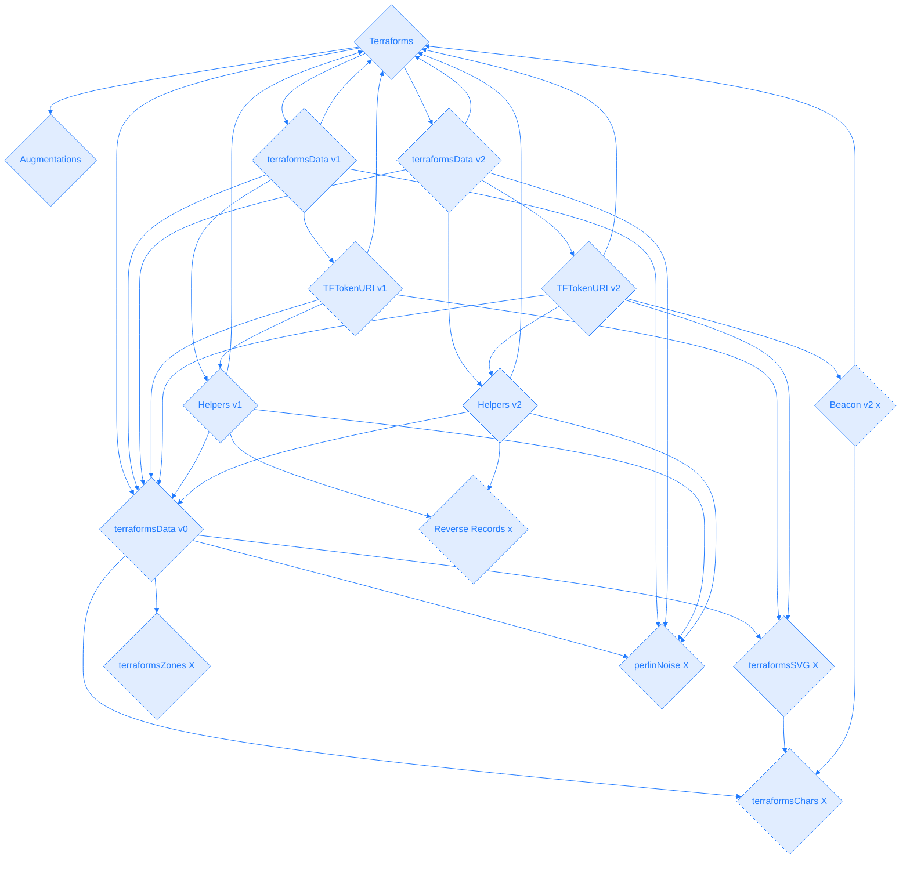
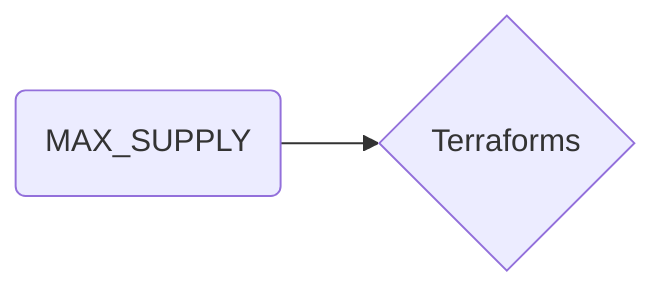

[0x4E1f41613c9084FdB9E34E11fAE9412427480e56](https://etherscan.io/token/0x4E1f41613c9084FdB9E34E11fAE9412427480e56#code)
<style>
ul#menu li {
  display:inline;
  margin-right: 5px;
  
}
ul#menu {
  padding-left: 0 !important;
}

.py-4 {
  background: none !important;
}
</style>

:::
<ul id="menu">
  <li><a href="https://remix.ethereum.org/#address=0x4e1f41613c9084fdb9e34e11fae9412427480e56&lang=en&optimize=false&runs=200&evmVersion=null&version=soljson-v0.8.22+commit.4fc1097e.js"></a></li>
    <li><a href="https://vscode.blockscan.com/ethereum/0x4E1f41613c9084FdB9E34E11fAE9412427480e56"></a></li>
</ul> 
:::



+++ Read
==- MAX_SUPPLY (uint256)

==- OWNER_ALLOTMENT (uint256)
==- PRICE (uint256)
==- REVEAL_TIMESTAMP (uint256)
==- SUPPLY (uint256)
==- TOKEN_SCALE (int256)
==- balanceOf (uint256)
==- dreamers (uint256)
==- earlyMintActive (bool)
==- getApproved (address)
==- isApprovedForAll (bool)
==- mintingPaused (bool)
==- name (string)
==- owner (address)
==- ownerOf (address)
==- seed (uint256)
==- structureData (uint256)
==- supportsInterface (bool)
==- symbol (string)
==- terraformsAugmentationAddress (address)
==- tokenByIndex (uint256)
==- tokenCharacters string[32][32]
==- tokenCounter (uint256)
==- tokenHTML (string)
==- tokenHeightmapIndicies (uint256[32][32])
==- tokenOfOwnerByIndex (uint256)
==- tokenSVG (string)
==- tokenSupplementalData (tuple)
==- tokenTerrainValues (int256[32][32])
==- tokenToAuthorizedDreamer (address)
==- tokenToCanvasData
==- tokenToDreamBlock
==- tokenToDreamer
==- tokenToPlacement
==- tokenToStatus
==- tokenURI
==- tokenURIAddresses
==- totalSupply
===
+++ Write
==- addTokenURIAddress
==- approve							
==- authorizeDreamer
==- commitDreamToCanvas
==- earlyMint
==- enterDream
==- mint
==- ownerClaim
==- redeemMintpass
==- renounceOwnership
==- safeTransferFrom
==- safeTransferFrom
==- setApprovalForAll
==- setMintpassHolders
==- setSeed
==- setTokenURIAddress
==- toggleEarly
==- togglePayse
==- transferFrom
==- transferOwnership
==- withrdraw
===
+++ Code
1. the resource address is 0x000000. Interesting this function has never been used.
2. augmentations may have been depricated via satalites. a vestigal arm.
=== File 1 of 18 : Ownable.sol
```js
// SPDX-License-Identifier: MIT
// OpenZeppelin Contracts v4.4.0 (access/Ownable.sol)

pragma solidity ^0.8.0;

import "../utils/Context.sol";

/**
 * @dev Contract module which provides a basic access control mechanism, where
 * there is an account (an owner) that can be granted exclusive access to
 * specific functions.
 *
 * By default, the owner account will be the one that deploys the contract. This
 * can later be changed with {transferOwnership}.
 *
 * This module is used through inheritance. It will make available the modifier
 * `onlyOwner`, which can be applied to your functions to restrict their use to
 * the owner.
 */
abstract contract Ownable is Context {
    address private _owner;

    event OwnershipTransferred(address indexed previousOwner, address indexed newOwner);

    /**
     * @dev Initializes the contract setting the deployer as the initial owner.
     */
    constructor() {
        _transferOwnership(_msgSender());
    }

    /**
     * @dev Returns the address of the current owner.
     */
    function owner() public view virtual returns (address) {
        return _owner;
    }

    /**
     * @dev Throws if called by any account other than the owner.
     */
    modifier onlyOwner() {
        require(owner() == _msgSender(), "Ownable: caller is not the owner");
        _;
    }

    /**
     * @dev Leaves the contract without owner. It will not be possible to call
     * `onlyOwner` functions anymore. Can only be called by the current owner.
     *
     * NOTE: Renouncing ownership will leave the contract without an owner,
     * thereby removing any functionality that is only available to the owner.
     */
    function renounceOwnership() public virtual onlyOwner {
        _transferOwnership(address(0));
    }

    /**
     * @dev Transfers ownership of the contract to a new account (`newOwner`).
     * Can only be called by the current owner.
     */
    function transferOwnership(address newOwner) public virtual onlyOwner {
        require(newOwner != address(0), "Ownable: new owner is the zero address");
        _transferOwnership(newOwner);
    }

    /**
     * @dev Transfers ownership of the contract to a new account (`newOwner`).
     * Internal function without access restriction.
     */
    function _transferOwnership(address newOwner) internal virtual {
        address oldOwner = _owner;
        _owner = newOwner;
        emit OwnershipTransferred(oldOwner, newOwner);
    }
}
```js
=== File 2 of 18 : ReentrancyGuard.sol
// SPDX-License-Identifier: MIT
// OpenZeppelin Contracts v4.4.0 (security/ReentrancyGuard.sol)

pragma solidity ^0.8.0;

/**
 * @dev Contract module that helps prevent reentrant calls to a function.
 *
 * Inheriting from `ReentrancyGuard` will make the {nonReentrant} modifier
 * available, which can be applied to functions to make sure there are no nested
 * (reentrant) calls to them.
 *
 * Note that because there is a single `nonReentrant` guard, functions marked as
 * `nonReentrant` may not call one another. This can be worked around by making
 * those functions `private`, and then adding `external` `nonReentrant` entry
 * points to them.
 *
 * TIP: If you would like to learn more about reentrancy and alternative ways
 * to protect against it, check out our blog post
 * https://blog.openzeppelin.com/reentrancy-after-istanbul/[Reentrancy After Istanbul].
 */
abstract contract ReentrancyGuard {
    // Booleans are more expensive than uint256 or any type that takes up a full
    // word because each write operation emits an extra SLOAD to first read the
    // slot's contents, replace the bits taken up by the boolean, and then write
    // back. This is the compiler's defense against contract upgrades and
    // pointer aliasing, and it cannot be disabled.

    // The values being non-zero value makes deployment a bit more expensive,
    // but in exchange the refund on every call to nonReentrant will be lower in
    // amount. Since refunds are capped to a percentage of the total
    // transaction's gas, it is best to keep them low in cases like this one, to
    // increase the likelihood of the full refund coming into effect.
    uint256 private constant _NOT_ENTERED = 1;
    uint256 private constant _ENTERED = 2;

    uint256 private _status;

    constructor() {
        _status = _NOT_ENTERED;
    }

    /**
     * @dev Prevents a contract from calling itself, directly or indirectly.
     * Calling a `nonReentrant` function from another `nonReentrant`
     * function is not supported. It is possible to prevent this from happening
     * by making the `nonReentrant` function external, and making it call a
     * `private` function that does the actual work.
     */
    modifier nonReentrant() {
        // On the first call to nonReentrant, _notEntered will be true
        require(_status != _ENTERED, "ReentrancyGuard: reentrant call");

        // Any calls to nonReentrant after this point will fail
        _status = _ENTERED;

        _;

        // By storing the original value once again, a refund is triggered (see
        // https://eips.ethereum.org/EIPS/eip-2200)
        _status = _NOT_ENTERED;
    }
}
```js
=== File 3 of 18 : ERC721.sol
// SPDX-License-Identifier: MIT
// OpenZeppelin Contracts v4.4.0 (token/ERC721/ERC721.sol)

pragma solidity ^0.8.0;

import "./IERC721.sol";
import "./IERC721Receiver.sol";
import "./extensions/IERC721Metadata.sol";
import "../../utils/Address.sol";
import "../../utils/Context.sol";
import "../../utils/Strings.sol";
import "../../utils/introspection/ERC165.sol";

/**
 * @dev Implementation of https://eips.ethereum.org/EIPS/eip-721[ERC721] Non-Fungible Token Standard, including
 * the Metadata extension, but not including the Enumerable extension, which is available separately as
 * {ERC721Enumerable}.
 */
contract ERC721 is Context, ERC165, IERC721, IERC721Metadata {
    using Address for address;
    using Strings for uint256;

    // Token name
    string private _name;

    // Token symbol
    string private _symbol;

    // Mapping from token ID to owner address
    mapping(uint256 => address) private _owners;

    // Mapping owner address to token count
    mapping(address => uint256) private _balances;

    // Mapping from token ID to approved address
    mapping(uint256 => address) private _tokenApprovals;

    // Mapping from owner to operator approvals
    mapping(address => mapping(address => bool)) private _operatorApprovals;

    /**
     * @dev Initializes the contract by setting a `name` and a `symbol` to the token collection.
     */
    constructor(string memory name_, string memory symbol_) {
        _name = name_;
        _symbol = symbol_;
    }

    /**
     * @dev See {IERC165-supportsInterface}.
     */
    function supportsInterface(bytes4 interfaceId) public view virtual override(ERC165, IERC165) returns (bool) {
        return
            interfaceId == type(IERC721).interfaceId ||
            interfaceId == type(IERC721Metadata).interfaceId ||
            super.supportsInterface(interfaceId);
    }

    /**
     * @dev See {IERC721-balanceOf}.
     */
    function balanceOf(address owner) public view virtual override returns (uint256) {
        require(owner != address(0), "ERC721: balance query for the zero address");
        return _balances[owner];
    }

    /**
     * @dev See {IERC721-ownerOf}.
     */
    function ownerOf(uint256 tokenId) public view virtual override returns (address) {
        address owner = _owners[tokenId];
        require(owner != address(0), "ERC721: owner query for nonexistent token");
        return owner;
    }

    /**
     * @dev See {IERC721Metadata-name}.
     */
    function name() public view virtual override returns (string memory) {
        return _name;
    }

    /**
     * @dev See {IERC721Metadata-symbol}.
     */
    function symbol() public view virtual override returns (string memory) {
        return _symbol;
    }

    /**
     * @dev See {IERC721Metadata-tokenURI}.
     */
    function tokenURI(uint256 tokenId) public view virtual override returns (string memory) {
        require(_exists(tokenId), "ERC721Metadata: URI query for nonexistent token");

        string memory baseURI = _baseURI();
        return bytes(baseURI).length > 0 ? string(abi.encodePacked(baseURI, tokenId.toString())) : "";
    }

    /**
     * @dev Base URI for computing {tokenURI}. If set, the resulting URI for each
     * token will be the concatenation of the `baseURI` and the `tokenId`. Empty
     * by default, can be overriden in child contracts.
     */
    function _baseURI() internal view virtual returns (string memory) {
        return "";
    }

    /**
     * @dev See {IERC721-approve}.
     */
    function approve(address to, uint256 tokenId) public virtual override {
        address owner = ERC721.ownerOf(tokenId);
        require(to != owner, "ERC721: approval to current owner");

        require(
            _msgSender() == owner || isApprovedForAll(owner, _msgSender()),
            "ERC721: approve caller is not owner nor approved for all"
        );

        _approve(to, tokenId);
    }

    /**
     * @dev See {IERC721-getApproved}.
     */
    function getApproved(uint256 tokenId) public view virtual override returns (address) {
        require(_exists(tokenId), "ERC721: approved query for nonexistent token");

        return _tokenApprovals[tokenId];
    }

    /**
     * @dev See {IERC721-setApprovalForAll}.
     */
    function setApprovalForAll(address operator, bool approved) public virtual override {
        _setApprovalForAll(_msgSender(), operator, approved);
    }

    /**
     * @dev See {IERC721-isApprovedForAll}.
     */
    function isApprovedForAll(address owner, address operator) public view virtual override returns (bool) {
        return _operatorApprovals[owner][operator];
    }

    /**
     * @dev See {IERC721-transferFrom}.
     */
    function transferFrom(
        address from,
        address to,
        uint256 tokenId
    ) public virtual override {
        //solhint-disable-next-line max-line-length
        require(_isApprovedOrOwner(_msgSender(), tokenId), "ERC721: transfer caller is not owner nor approved");

        _transfer(from, to, tokenId);
    }

    /**
     * @dev See {IERC721-safeTransferFrom}.
     */
    function safeTransferFrom(
        address from,
        address to,
        uint256 tokenId
    ) public virtual override {
        safeTransferFrom(from, to, tokenId, "");
    }

    /**
     * @dev See {IERC721-safeTransferFrom}.
     */
    function safeTransferFrom(
        address from,
        address to,
        uint256 tokenId,
        bytes memory _data
    ) public virtual override {
        require(_isApprovedOrOwner(_msgSender(), tokenId), "ERC721: transfer caller is not owner nor approved");
        _safeTransfer(from, to, tokenId, _data);
    }

    /**
     * @dev Safely transfers `tokenId` token from `from` to `to`, checking first that contract recipients
     * are aware of the ERC721 protocol to prevent tokens from being forever locked.
     *
     * `_data` is additional data, it has no specified format and it is sent in call to `to`.
     *
     * This internal function is equivalent to {safeTransferFrom}, and can be used to e.g.
     * implement alternative mechanisms to perform token transfer, such as signature-based.
     *
     * Requirements:
     *
     * - `from` cannot be the zero address.
     * - `to` cannot be the zero address.
     * - `tokenId` token must exist and be owned by `from`.
     * - If `to` refers to a smart contract, it must implement {IERC721Receiver-onERC721Received}, which is called upon a safe transfer.
     *
     * Emits a {Transfer} event.
     */
    function _safeTransfer(
        address from,
        address to,
        uint256 tokenId,
        bytes memory _data
    ) internal virtual {
        _transfer(from, to, tokenId);
        require(_checkOnERC721Received(from, to, tokenId, _data), "ERC721: transfer to non ERC721Receiver implementer");
    }

    /**
     * @dev Returns whether `tokenId` exists.
     *
     * Tokens can be managed by their owner or approved accounts via {approve} or {setApprovalForAll}.
     *
     * Tokens start existing when they are minted (`_mint`),
     * and stop existing when they are burned (`_burn`).
     */
    function _exists(uint256 tokenId) internal view virtual returns (bool) {
        return _owners[tokenId] != address(0);
    }

    /**
     * @dev Returns whether `spender` is allowed to manage `tokenId`.
     *
     * Requirements:
     *
     * - `tokenId` must exist.
     */
    function _isApprovedOrOwner(address spender, uint256 tokenId) internal view virtual returns (bool) {
        require(_exists(tokenId), "ERC721: operator query for nonexistent token");
        address owner = ERC721.ownerOf(tokenId);
        return (spender == owner || getApproved(tokenId) == spender || isApprovedForAll(owner, spender));
    }

    /**
     * @dev Safely mints `tokenId` and transfers it to `to`.
     *
     * Requirements:
     *
     * - `tokenId` must not exist.
     * - If `to` refers to a smart contract, it must implement {IERC721Receiver-onERC721Received}, which is called upon a safe transfer.
     *
     * Emits a {Transfer} event.
     */
    function _safeMint(address to, uint256 tokenId) internal virtual {
        _safeMint(to, tokenId, "");
    }

    /**
     * @dev Same as {xref-ERC721-_safeMint-address-uint256-}[`_safeMint`], with an additional `data` parameter which is
     * forwarded in {IERC721Receiver-onERC721Received} to contract recipients.
     */
    function _safeMint(
        address to,
        uint256 tokenId,
        bytes memory _data
    ) internal virtual {
        _mint(to, tokenId);
        require(
            _checkOnERC721Received(address(0), to, tokenId, _data),
            "ERC721: transfer to non ERC721Receiver implementer"
        );
    }

    /**
     * @dev Mints `tokenId` and transfers it to `to`.
     *
     * WARNING: Usage of this method is discouraged, use {_safeMint} whenever possible
     *
     * Requirements:
     *
     * - `tokenId` must not exist.
     * - `to` cannot be the zero address.
     *
     * Emits a {Transfer} event.
     */
    function _mint(address to, uint256 tokenId) internal virtual {
        require(to != address(0), "ERC721: mint to the zero address");
        require(!_exists(tokenId), "ERC721: token already minted");

        _beforeTokenTransfer(address(0), to, tokenId);

        _balances[to] += 1;
        _owners[tokenId] = to;

        emit Transfer(address(0), to, tokenId);
    }

    /**
     * @dev Destroys `tokenId`.
     * The approval is cleared when the token is burned.
     *
     * Requirements:
     *
     * - `tokenId` must exist.
     *
     * Emits a {Transfer} event.
     */
    function _burn(uint256 tokenId) internal virtual {
        address owner = ERC721.ownerOf(tokenId);

        _beforeTokenTransfer(owner, address(0), tokenId);

        // Clear approvals
        _approve(address(0), tokenId);

        _balances[owner] -= 1;
        delete _owners[tokenId];

        emit Transfer(owner, address(0), tokenId);
    }

    /**
     * @dev Transfers `tokenId` from `from` to `to`.
     *  As opposed to {transferFrom}, this imposes no restrictions on msg.sender.
     *
     * Requirements:
     *
     * - `to` cannot be the zero address.
     * - `tokenId` token must be owned by `from`.
     *
     * Emits a {Transfer} event.
     */
    function _transfer(
        address from,
        address to,
        uint256 tokenId
    ) internal virtual {
        require(ERC721.ownerOf(tokenId) == from, "ERC721: transfer of token that is not own");
        require(to != address(0), "ERC721: transfer to the zero address");

        _beforeTokenTransfer(from, to, tokenId);

        // Clear approvals from the previous owner
        _approve(address(0), tokenId);

        _balances[from] -= 1;
        _balances[to] += 1;
        _owners[tokenId] = to;

        emit Transfer(from, to, tokenId);
    }

    /**
     * @dev Approve `to` to operate on `tokenId`
     *
     * Emits a {Approval} event.
     */
    function _approve(address to, uint256 tokenId) internal virtual {
        _tokenApprovals[tokenId] = to;
        emit Approval(ERC721.ownerOf(tokenId), to, tokenId);
    }

    /**
     * @dev Approve `operator` to operate on all of `owner` tokens
     *
     * Emits a {ApprovalForAll} event.
     */
    function _setApprovalForAll(
        address owner,
        address operator,
        bool approved
    ) internal virtual {
        require(owner != operator, "ERC721: approve to caller");
        _operatorApprovals[owner][operator] = approved;
        emit ApprovalForAll(owner, operator, approved);
    }

    /**
     * @dev Internal function to invoke {IERC721Receiver-onERC721Received} on a target address.
     * The call is not executed if the target address is not a contract.
     *
     * @param from address representing the previous owner of the given token ID
     * @param to target address that will receive the tokens
     * @param tokenId uint256 ID of the token to be transferred
     * @param _data bytes optional data to send along with the call
     * @return bool whether the call correctly returned the expected magic value
     */
    function _checkOnERC721Received(
        address from,
        address to,
        uint256 tokenId,
        bytes memory _data
    ) private returns (bool) {
        if (to.isContract()) {
            try IERC721Receiver(to).onERC721Received(_msgSender(), from, tokenId, _data) returns (bytes4 retval) {
                return retval == IERC721Receiver.onERC721Received.selector;
            } catch (bytes memory reason) {
                if (reason.length == 0) {
                    revert("ERC721: transfer to non ERC721Receiver implementer");
                } else {
                    assembly {
                        revert(add(32, reason), mload(reason))
                    }
                }
            }
        } else {
            return true;
        }
    }

    /**
     * @dev Hook that is called before any token transfer. This includes minting
     * and burning.
     *
     * Calling conditions:
     *
     * - When `from` and `to` are both non-zero, ``from``'s `tokenId` will be
     * transferred to `to`.
     * - When `from` is zero, `tokenId` will be minted for `to`.
     * - When `to` is zero, ``from``'s `tokenId` will be burned.
     * - `from` and `to` are never both zero.
     *
     * To learn more about hooks, head to xref:ROOT:extending-contracts.adoc#using-hooks[Using Hooks].
     */
    function _beforeTokenTransfer(
        address from,
        address to,
        uint256 tokenId
    ) internal virtual {}
}
```
=== File 4 of 18 : IERC721.sol
```js
// SPDX-License-Identifier: MIT
// OpenZeppelin Contracts v4.4.0 (token/ERC721/IERC721.sol)

pragma solidity ^0.8.0;

import "../../utils/introspection/IERC165.sol";

/**
 * @dev Required interface of an ERC721 compliant contract.
 */
interface IERC721 is IERC165 {
    /**
     * @dev Emitted when `tokenId` token is transferred from `from` to `to`.
     */
    event Transfer(address indexed from, address indexed to, uint256 indexed tokenId);

    /**
     * @dev Emitted when `owner` enables `approved` to manage the `tokenId` token.
     */
    event Approval(address indexed owner, address indexed approved, uint256 indexed tokenId);

    /**
     * @dev Emitted when `owner` enables or disables (`approved`) `operator` to manage all of its assets.
     */
    event ApprovalForAll(address indexed owner, address indexed operator, bool approved);

    /**
     * @dev Returns the number of tokens in ``owner``'s account.
     */
    function balanceOf(address owner) external view returns (uint256 balance);

    /**
     * @dev Returns the owner of the `tokenId` token.
     *
     * Requirements:
     *
     * - `tokenId` must exist.
     */
    function ownerOf(uint256 tokenId) external view returns (address owner);

    /**
     * @dev Safely transfers `tokenId` token from `from` to `to`, checking first that contract recipients
     * are aware of the ERC721 protocol to prevent tokens from being forever locked.
     *
     * Requirements:
     *
     * - `from` cannot be the zero address.
     * - `to` cannot be the zero address.
     * - `tokenId` token must exist and be owned by `from`.
     * - If the caller is not `from`, it must be have been allowed to move this token by either {approve} or {setApprovalForAll}.
     * - If `to` refers to a smart contract, it must implement {IERC721Receiver-onERC721Received}, which is called upon a safe transfer.
     *
     * Emits a {Transfer} event.
     */
    function safeTransferFrom(
        address from,
        address to,
        uint256 tokenId
    ) external;

    /**
     * @dev Transfers `tokenId` token from `from` to `to`.
     *
     * WARNING: Usage of this method is discouraged, use {safeTransferFrom} whenever possible.
     *
     * Requirements:
     *
     * - `from` cannot be the zero address.
     * - `to` cannot be the zero address.
     * - `tokenId` token must be owned by `from`.
     * - If the caller is not `from`, it must be approved to move this token by either {approve} or {setApprovalForAll}.
     *
     * Emits a {Transfer} event.
     */
    function transferFrom(
        address from,
        address to,
        uint256 tokenId
    ) external;

    /**
     * @dev Gives permission to `to` to transfer `tokenId` token to another account.
     * The approval is cleared when the token is transferred.
     *
     * Only a single account can be approved at a time, so approving the zero address clears previous approvals.
     *
     * Requirements:
     *
     * - The caller must own the token or be an approved operator.
     * - `tokenId` must exist.
     *
     * Emits an {Approval} event.
     */
    function approve(address to, uint256 tokenId) external;

    /**
     * @dev Returns the account approved for `tokenId` token.
     *
     * Requirements:
     *
     * - `tokenId` must exist.
     */
    function getApproved(uint256 tokenId) external view returns (address operator);

    /**
     * @dev Approve or remove `operator` as an operator for the caller.
     * Operators can call {transferFrom} or {safeTransferFrom} for any token owned by the caller.
     *
     * Requirements:
     *
     * - The `operator` cannot be the caller.
     *
     * Emits an {ApprovalForAll} event.
     */
    function setApprovalForAll(address operator, bool _approved) external;

    /**
     * @dev Returns if the `operator` is allowed to manage all of the assets of `owner`.
     *
     * See {setApprovalForAll}
     */
    function isApprovedForAll(address owner, address operator) external view returns (bool);

    /**
     * @dev Safely transfers `tokenId` token from `from` to `to`.
     *
     * Requirements:
     *
     * - `from` cannot be the zero address.
     * - `to` cannot be the zero address.
     * - `tokenId` token must exist and be owned by `from`.
     * - If the caller is not `from`, it must be approved to move this token by either {approve} or {setApprovalForAll}.
     * - If `to` refers to a smart contract, it must implement {IERC721Receiver-onERC721Received}, which is called upon a safe transfer.
     *
     * Emits a {Transfer} event.
     */
    function safeTransferFrom(
        address from,
        address to,
        uint256 tokenId,
        bytes calldata data
    ) external;
}
```
=== File 5 of 18 : IERC721Receiver.sol
=== File 6 of 18 : ERC721Enumerable.sol
=== File 7 of 18 : IERC721Enumerable.sol
=== File 8 of 18 : IERC721Metadata.sol
=== File 9 of 18 : Address.sol
=== File 10 of 18 : Context.sol
=== File 11 of 18 : Strings.sol
=== File 12 of 18 : ERC165.sol
=== File 13 of 18 : IERC165.sol
=== File 14 of 18 : ITerraformsData.sol
=== File 15 of 18 : Terraforms.sol
=== File 16 of 18 : TerraformsAdmin.sol
=== File 17 of 18 : TerraformsDreaming.sol
=== File 18 of 18 : TerraformsPlacements.sol
===
+++
