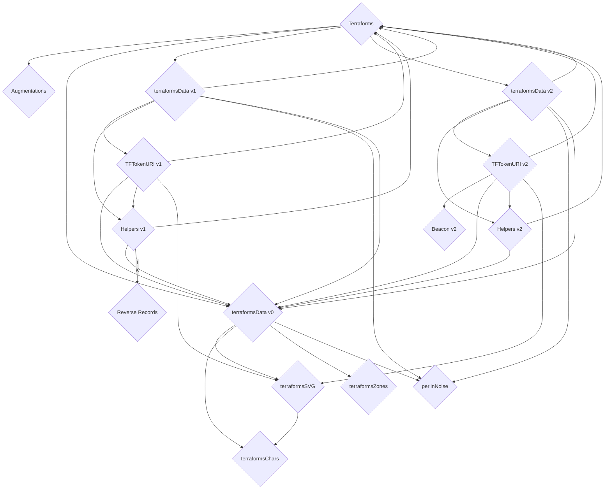
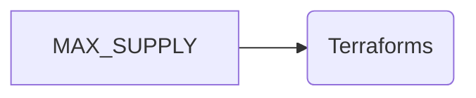

[0x4E1f41613c9084FdB9E34E11fAE9412427480e56](https://etherscan.io/token/0x4E1f41613c9084FdB9E34E11fAE9412427480e56#code)
<style>
ul#menu li {
  display:inline;
  margin-right: 5px;
  
}
ul#menu {
  padding-left: 0 !important;
}
</style>

:::
<ul id="menu">
  <li><a href="https://remix.ethereum.org/#address=0x4e1f41613c9084fdb9e34e11fae9412427480e56&lang=en&optimize=false&runs=200&evmVersion=null&version=soljson-v0.8.22+commit.4fc1097e.js"></a></li>
    <li><a href="https://vscode.blockscan.com/ethereum/0x4E1f41613c9084FdB9E34E11fAE9412427480e56"></a></li>
</ul> 
:::



+++ Read
==- MAX_SUPPLY (uint256)
MAX_SUPPLY is a public variable with the value 11,104 and is declared on contract creation. The variable constrains the total supply of terraforms which may be minted and is utilized in generating sudo-random placements of terraform parcels.

```js
uint public constant MAX_SUPPLY = 11_104;
```


uint[MAX_SUPPLY] placementShuffler;

==- OWNER_ALLOTMENT (uint256)
==- PRICE (uint256)
==- REVEAL_TIMESTAMP (uint256)
==- SUPPLY (uint256)
==- TOKEN_SCALE (int256)
==- balanceOf (uint256)
==- dreamers (uint256)
==- earlyMintActive (bool)
==- getApproved (address)
==- isApprovedForAll (bool)
==- mintingPaused (bool)
==- name (string)
==- owner (address)
==- ownerOf (address)
==- seed (uint256)
==- structureData (uint256)
==- supportsInterface (bool)
==- symbol (string)
==- terraformsAugmentationAddress (address)
==- tokenByIndex (uint256)
==- tokenCharacters string[32][32]
==- tokenCounter (uint256)
==- tokenHTML (string)
==- tokenHeightmapIndicies (uint256[32][32])
==- tokenOfOwnerByIndex (uint256)
==- tokenSVG (string)
==- tokenSupplementalData (tuple)
==- tokenTerrainValues (int256[32][32])
==- tokenToAuthorizedDreamer (address)
==- tokenToCanvasData
==- tokenToDreamBlock
==- tokenToDreamer
==- tokenToPlacement
==- tokenToStatus
==- tokenURI
==- tokenURIAddresses
==- totalSupply
===
+++ Write
==- addTokenURIAddress
==- approve							
==- authorizeDreamer
==- commitDreamToCanvas
==- earlyMint
==- enterDream
==- mint
==- ownerClaim
==- redeemMintpass
==- renounceOwnership
==- safeTransferFrom
==- safeTransferFrom
==- setApprovalForAll
==- setMintpassHolders
==- setSeed
==- setTokenURIAddress
==- toggleEarly
==- togglePayse
==- transferFrom
==- transferOwnership
==- withrdraw
===
+++ Code

+++
